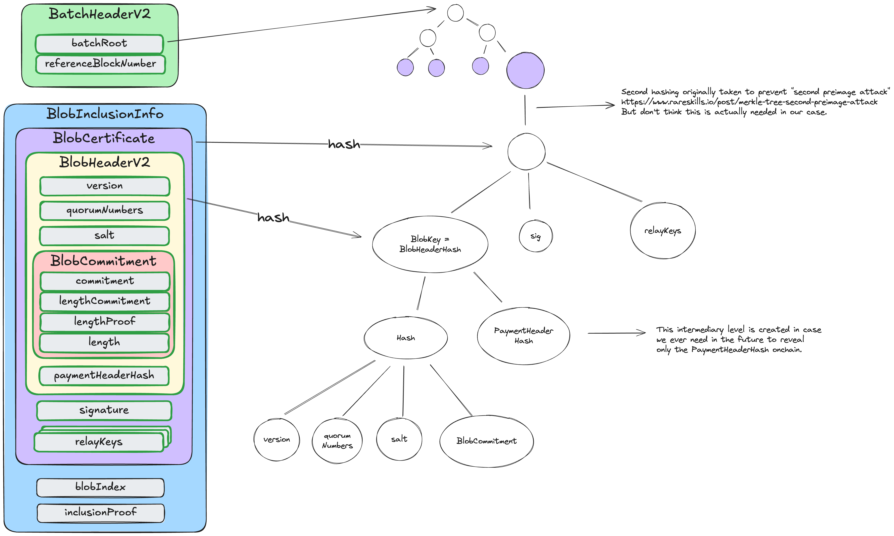

# EigenDA Data Structures

## BlobKey (Blob Header Hash)

`blobKey` ( `blob_header_hash` 또는 `blobHeaderHash` 라고도 함)는 EigenDA 전반에서 사용되는 주요 식별자다. 32-byte 값으로 각 blob dispersal을 고유하게 식별하며, dispersal status 조회, blob retrieval, blob과 certificate를 연결할 때 사용한다.

### 일반적인 사용 사례

blob key를 다루는 주요 시나리오는 두 가지다:

**1. 데이터를 가지고 있고 blob key를 계산해야 하는 경우 (직접 dispersal)**

`DisperseBlob` 을 데이터와 함께 직접 호출하면 disperser가 blob key를 계산해 반환해 준다. 이 blob key로 `GetBlobStatus` 를 polling해 dispersal이 완료되면 Relay API 또는 validator로 blob을 retrieve한다. blob key 계산은 disperser가 처리하지만, 자체 계산 결과와 일치하는지 검증해야 한다.

**2. commitment를 가지고 있고 blob key를 직접 계산해야 하는 경우 (proxy dispersal — 가장 흔한 패턴)**

EigenDA proxy를 사용할 때, rollup은 dispersal 후 DA commitment를 받지만, 이후 데이터를 retrieve하기 위해 blob key를 직접 계산해야 한다:
1. commitment에서 `BlobCertificate` 를 deserialize한다.
2. certificate에서 `BlobHeader` 를 추출한다.
3. header를 hashing해 blob key를 계산한다 (아래 "BlobKey 계산 방식" 참고).
4. 이 blob key로 relay의 `GetBlob` 또는 validator의 `GetChunks` 를 호출한다.

이 proxy 흐름은 EigenDA와 통합하는 rollup의 가장 흔한 패턴이다.

### BlobKey 계산 방식

blob key는 ABI 인코딩된 `BlobHeader` 의 keccak256 hash다. hashing은 nested 구조로 이뤄진다: 먼저 blob의 컨텐츠와 dispersal 요구사항(version, quorum, commitment)을 hashing하고, 그 결과를 payment metadata hash와 결합한다. 즉 동일한 blob 컨텐츠라도 다른 payment 조건으로 dispersal하면 매번 다른 blob key를 갖는다.

disperser는 고유성을 강제한다 — 이전에 사용된 blob key로 blob dispersal을 시도하면 요청은 거부된다.

실제로는 SDK를 사용해 blob key를 계산한다. Go에서의 예시는 다음과 같다:

```go
import (
    "github.com/Layr-Labs/eigenda/core/v2"
    "github.com/Layr-Labs/eigenda/encoding"
)

// Compute the blob key from blob header components
blobKey := core.ComputeBlobKey(
    blobVersion,        // BlobVersion
    blobCommitments,    // encoding.BlobCommitments (G1 and G2 points)
    quorumNumbers,      // []core.QuorumID (automatically sorted)
    paymentMetadataHash, // [32]byte
)
```

이 함수는 nested hash를 수행한다:
1. 먼저 blob version, quorum number(정렬된), commitment를 hashing한다.
2. 그 결과 hash를 payment metadata hash와 결합해 다시 hashing한다.
3. 32-byte blob key를 반환한다.

몇 가지 중요한 사항:
- `paymentMetadataHash` 는 본인의 `PaymentHeader` 구조체로부터 미리 계산되어야 한다.
- 일관성을 위해 quorum number는 hashing 전에 자동으로 정렬된다.
- 이 구현은 [`hashBlobHeaderV2()` (Solidity)](https://github.com/Layr-Labs/eigenda/blob/d73a9fa66a44dd2cfd334dcb83614cd5c1c5e005/contracts/src/integrations/cert/libraries/EigenDACertVerificationLib.sol#L324)의 onchain hashing과 동일하다.

전체 구현은 다음을 참고한다: [Go의 `ComputeBlobKey()`](https://github.com/Layr-Labs/eigenda/blob/d73a9fa66a44dd2cfd334dcb83614cd5c1c5e005/core/v2/serialization.go#L42)

### 누가 계산하는가

disperser는 blob key를 계산해 `DisperseBlobReply` 에 담아 반환한다. 검증을 위해 client가 직접 계산할 수도 있다 — 사실 client는 자신이 보낸 `BlobHeader` 로 blob key를 다시 계산해 반환된 blob key를 검증해야 한다. Go client는 [`verifyReceivedBlobKey()`](https://github.com/Layr-Labs/eigenda/blob/6be8c9352c8e73c9f4f0ba00560ff3230bbba822/api/clients/v2/payloaddispersal/payload_disperser.go#L370-L400)에서 이를 보여준다.

위에서 언급한 proxy 흐름의 경우, DA commitment에 포함된 certificate로부터 blob key를 직접 계산하게 된다.

### 예시 (Example)

구체적인 예시를 보자. 다음과 같은 blob을 dispersal한다고 하자:
- `version`: `0x0001`
- `quorumNumbers`: `[0, 1]` (정렬됨)
- `commitment`: blob 데이터에 대한 cryptographic commitment (G1 point와 G2 length commitment)
- `paymentHeaderHash`: `0x1234...` (PaymentHeader의 32-byte hash)

blob key 계산은 두 단계로 이뤄진다:

먼저 핵심 dispersal 파라미터를 hashing한다:
```
innerHash = keccak256(abi.encode(version, quorumNumbers, commitment))
```

그 다음 그 결과를 payment hash와 결합한다:
```
blobKey = keccak256(abi.encode(innerHash, paymentHeaderHash))
```

이 blob key로 `GetBlobStatus` 로 dispersal status를 조회하거나, validator의 `GetChunks` 로 chunk를 retrieve하거나, relay의 `GetBlob` 으로 전체 blob을 가져올 수 있다.

### 다른 구조체들과의 관계

blob key는 `BlobHeader` 의 hash다. `BlobCertificate` 는 그 header를 signature와 relay key와 함께 wrapping한다. certificate가 batch에 포함되었음을 증명할 때는 certificate에 Merkle proof를 더한 `BlobInclusionInfo` 를 사용한다. `BatchHeader` 는 `batchRoot` 를 가지며, 이는 leaf가 각각 `BlobCertificate` 의 hash인 Merkle tree의 root다.



## BlobHeader

`BlobHeader` 는 blob dispersal에 대한 메타데이터를 담는다 — version, quorum number, blob commitment, payment 정보. `DisperseBlob` 요청에서 blob 데이터와 함께 제출한다.

field 세부사항은 [protobuf 정의](https://github.com/Layr-Labs/eigenda/blob/master/api/proto/disperser/v2/disperser_v2.proto)를 참고한다.

## BlobCertificate

`BlobCertificate` 는 `BlobHeader` 를 signature 및 relay key와 함께 묶는다. blob status 응답에서 찾을 수 있으며, blob availability 검증과 데이터 retrieval에 필요한 모든 것을 담고 있다.

field 세부사항은 [protobuf 정의](https://github.com/Layr-Labs/eigenda/blob/master/api/proto/common/v2/common_v2.proto)를 참고한다.
