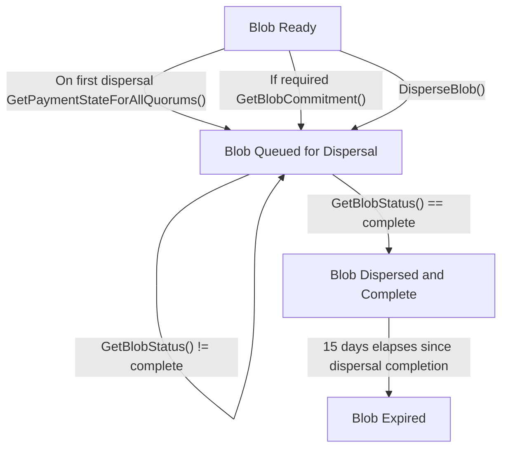

# API 개요 (Overview)

## Blob Dispersal (블롭 분산 전송)

EigenDA Disperser는 다음 기능을 제공하는 API를 제공한다:
* EigenDA 네트워크에 blob dispersal.
* [유연한 결제 방식: on-demand 및 reserved bandwidth](https://docs.eigencloud.xyz/products/eigenda/core-concepts/payments).

> 📝 **Note**
>
> EigenDA 네트워크는 핵심 data availability 보장의 일부로, blob retrieval을 위해 EigenDA validator와의 직접 통신을 지원한다.

Disperser API의 low level 명세는 [disperser.proto](https://github.com/Layr-Labs/eigenda/blob/master/api/proto/disperser/v2/disperser_v2.proto)다. 이 문서의 목표는 이 명세를 더 높은 수준에서 설명하는 것이다.

Eigen Labs는 각 EigenDA 네트워크별로 disperser endpoint를 호스팅한다. 이 endpoint는 [Mainnet](../networks/mainnet.md)과 [Sepolia](../networks/sepolia.md) 네트워크 페이지에 각각 정리되어 있다.

### Disperser Endpoint (디스퍼서 엔드포인트)

EigenDA Disperser는 다음 endpoint를 노출한다:

* `DisperseBlob()`
* `GetBlobStatus()`
* `GetBlobCommitment()`
* `GetPaymentStateForAllQuorums()`

> 📝 **Note**
>
> `GetPaymentSate()` 는 deprecated되었다. `GetPaymentStateForAllQuorums()` 를 사용한다.

### Blob Dispersal Lifecycle (라이프사이클)

이 endpoint들은 blob dispersal을 위한 enqueueing부터 client가 요구한 quorum threshold를 충족하는 DA certificate를 기다리는 단계까지의 lifecycle을 가능하게 한다. Disperser는 비동기 API를 제공하며, client는 `DisperseBlob()` endpoint 호출에서 받은 [blob key](data-structures.md#blobkey-blob-header-hash)로 disperser가 blob을 successfully dispersed and complete로 보고할 때까지 `GetBlobStatus()` endpoint를 polling한다.

다음 flowchart는 이 endpoint들과 관련된 blob의 lifecycle 흐름을 보여준다:

> 📝 **Note**
>
> `GetBlobStatus()` 응답에는 relay key가 포함된다. 현재 relay URL을 hard coding하지 말고, [onchain의 `EigenDARelayRegistry`](https://github.com/Layr-Labs/eigenda/blob/a6e6a31474caf73f2994301567dc0e64d6ac2e80/contracts/src/core/EigenDARelayRegistry.sol#L32) contract에서 relay URL을 가져온다.

> 💡 **Tip**
>
> 여기서는 주요 API endpoint에 대한 narrative 수준의 설명을 제공한다. field 단위 자세한 API 문서는 [repo](https://github.com/Layr-Labs/eigenda/blob/master/api/proto/disperser/v2/disperser_v2.proto)를 참고한다.

## Blob Retrieval (블롭 조회)

blob은 다음 두 곳에서 retrieve할 수 있다:
* Relay
* Validator

일반적으로 unencoded blob을 relay에서 직접 retrieve하는 것이 더 빠르고 간단하므로, end user는 먼저 relay에서 데이터 retrieval을 시도해야 한다. relay에서의 retrieval은 더 적은 대역폭과 연산을 요구하며, validator에서의 retrieval보다 capacity가 높고 평균 latency가 낮다. blob을 보유한 모든 relay가 다운되거나 악의적으로 데이터를 withholding하더라도, validator node에 분산된 chunk 중 일부만 있으면 원본 데이터를 재구성할 수 있으므로 validator node는 데이터를 가져올 수 있는 신뢰할 만한 수단이 된다.

### Relay Endpoint (릴레이 엔드포인트)

 EigenDA Relay는 다음 endpoint를 노출한다:
 * `GetBlob()`
 * `GetChunks()`

> 💡 **Tip**
>
> 여기서는 주요 API endpoint에 대한 narrative 수준의 설명을 제공한다. field 단위 자세한 API 문서는 현재 release에 맞춘 [repo](https://github.com/Layr-Labs/eigenda/blob/master/api/proto/relay/relay.proto)를 참고한다.

### Validator Endpoint (밸리데이터 엔드포인트)

EigenDA Node는 다음 retrieval endpoint를 노출한다:
* `RetrieveChunks()`
* `GetBlobHeader()`
* `NodeInfo()`

> 💡 **Tip**
>
> 여기서는 주요 API endpoint에 대한 narrative 수준의 설명을 제공한다. field 단위 자세한 API 문서는 [repo](https://github.com/Layr-Labs/eigenda/blob/master/api/proto/node/node.proto)를 참고한다.

