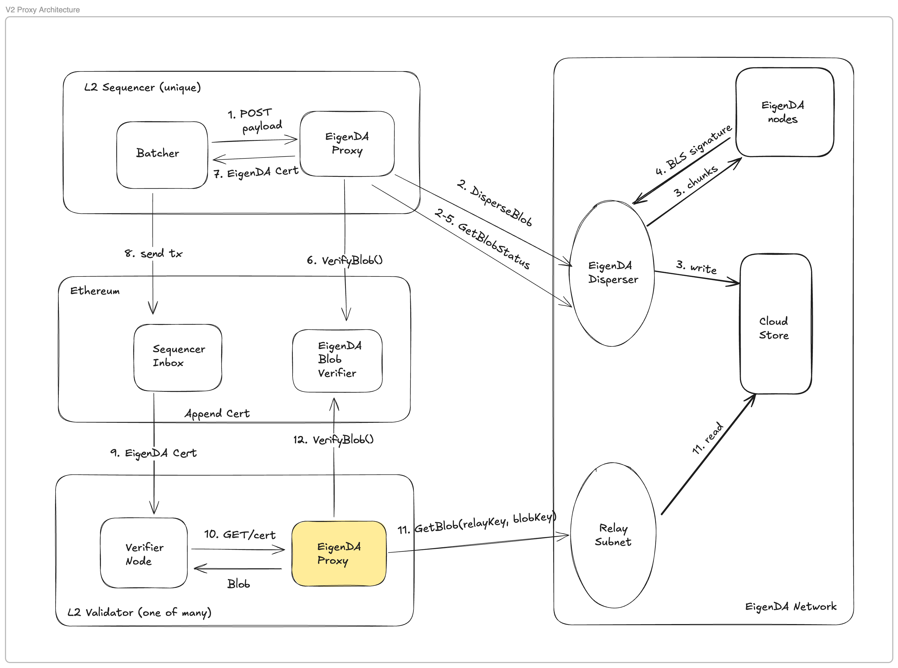

# EigenDA Proxy (프록시)

## 개요

EigenDA proxy는 EigenDA 네트워크와의 통신을 위해 rollup node cluster의 일부로 실행되는 sidecar server다.

:::note
전체 설정 세부사항은 [EigenDA proxy Readme](https://github.com/Layr-Labs/eigenda/tree/master/api/proxy#eigenda-proxy-)를 참고한다.
:::

### Rollup 상호작용 다이어그램 예시
아래는 rollup stack 전반에서 다양한 네트워크 역할(즉 sequencer, verifier)이 proxy를 어떻게 사용하는지 보여주는 high level flow다. parent chain inbox 또는 safe head로부터 직접 sync하려는 EigenDA 통합 rollup node는 이 서비스를 반드시 실행해야 한다.

### 사용

rollup 토폴로지의 다양한 행위자는 EigenDA와의 통신을 위해 다음과 같이 proxy를 사용해야 한다:
- **Rollup Sequencer:** proxy에 batch를 게시하고 인증된 DA certificate를 batch inbox에 제출한다.
- **Rollup Verifier Node:** proxy로부터 batch를 읽어 local state view를 갱신한다 (*parent chain에서 직접 sync한다고 가정*).

- **Prover Node:** 두 rollup 유형(즉 optimistic, zero knowledge) 모두, child --> parent bridge withdraw 증명 생성을 위해 parent chain inbox로부터 child chain state를 도출하는 어떤 방식이든 갖고 있을 것이다. 이러한 "proving pipeline" 또한 proxy로부터 데이터를 읽는다. optimistic rollup의 경우 fraud proof를 활용한 dispute 해결, zero knowledge rollup의 경우 어떤 batch 실행의 유효성을 입증하는 zero knowledge proof 생성을 위해서다.

*예: Arbitrum에는 parent chain의 rollup assertion chain에 state claim을 게시하는 `MakeNode` validator가 있다. 챌린지 발생 시, asserter/challenger 양 측은 자신들이 bisection할 WAVM 실행 trace를 계산하기 위해 proxy로부터 읽은 batch로 local pre-image store를 미리 채워야 한다.*

:::note
사용에 필요한 payment 설정은 이 [Quick Start](../quick-start/v2/index.md)를 참고한다.
:::
## 기술 세부사항
[EigenDA Proxy](https://github.com/Layr-Labs/eigenda/tree/master/api/proxy#eigenda-proxy-)는 [high-level EigenDA client](https://github.com/Layr-Labs/eigenda/blob/master/api/clients/eigenda_client.go)를 HTTP server로 감싸며, blob을 읽고 쓸 때 추가 검증 작업을 수행해 EigenDA disperser 서비스에 대한 모든 신뢰 가정을 제거한다. EigenDA Proxy는 추가 보안 기능(예: read fallback)과 선택적 성능 최적화(예: caching)도 제공한다. 서비스 빌드 및 실행 방법은 [여기](https://github.com/Layr-Labs/eigenda/tree/master/api/proxy#eigenda-proxy-)에서 확인할 수 있다.

## 권장 설정 유형
다양한 proxy 설정을 통해 보안 조치 및 런타임 최적화를 다르게 적용할 수 있다. 설정 플래그는 [여기](https://github.com/Layr-Labs/eigenda/tree/master/api/proxy#eigenda-proxy-)에서 확인할 수 있다. 다양한 rollup node 행위자 유형별로 다음을 권장한다:

### Batcher (배처)
EigenDA에 rollup batch를 제출하는 책임을 가진 권한 있는 역할은 다음 preset을 갖춰야 한다:
- Certificate verification 활성화. rollup (stage = 0)이 쓰기에 대해 `EigenDAServiceManager` 와 DA cert를 비교 검증하지 않는다면, `ETH_CONFIRMATION_DEPTH` 를 합리적인 값(즉 >= 6)으로 설정해야 한다. 그렇지 않으면 Ethereum에서 reorg된 EigenDA blob batch header로 sequencer inbox에 certificate가 제출될 수 있다.

### Bridge Validator (브릿지 밸리데이터)
child --> parent chain withdraw bridge를 방어하거나 진행시키는 책임을 가진 validator는 다음과 같이 설정해야 한다:
- Certificate verification 활성화
- EigenDA retrieval 실패 시에도 blob을 읽을 수 있도록 보조 backend가 설정된 read fallback

### Permissionless Verifier (무허가형 검증자)
- Certificate verification 활성화
- EigenDA에서의 데이터 read를 한 번만 수행하도록 cached backend provider 사용
