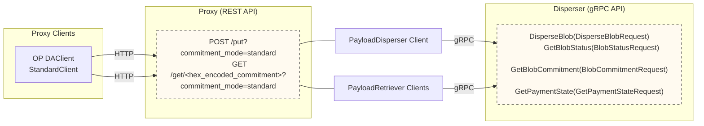

# 통합 가이드 개요 (Integrations Overview)

payload를 disperse하고 retrieve하는 방법은 세 가지가 있다:
1. proxy server를 운영하고 [REST API](https://github.com/Layr-Labs/eigenda-proxy?tab=readme-ov-file#rest-api-routes)를 사용한다. 가장 단순한 방법이다.
2. [golang](https://github.com/Layr-Labs/eigenda/blob/master/api/clients/disperser_client.go) 또는 [rust](https://github.com/Layr-Labs/eigenda-client-rs) 클라이언트를 gRPC API 및 onchain 인터페이스와 함께 사용한다.
3. gRPC API 및 onchain 인터페이스와 함께 사용할 자체 클라이언트를 직접 작성한다.

> 📝 **Note**
>
> 고급 사용 사례에서는 클라이언트를 직접 사용하는 방식(즉 위 옵션 2 또는 3)이 필요할 수 있다. 예를 들어 ZKsync는 [ZK Stack](rollup-guides/zksync/README.md) sequencer를 단일 binary로 유지하고 싶었고 proxy를 위한 sidecar 프로세스를 띄우는 것을 원하지 않았다. 그래서 자신의 DA dispatcher 코드에 우리의 rust 클라이언트를 직접 통합했다. 대부분의 사용자에게는 EigenDA proxy 사용을 권장한다. [Arbitrum Nitro](rollup-guides/orbit/overview.md)와 [Op Stack](rollup-guides/op-stack/README.md) 통합도 이 방식으로 동작한다.

아래 다이어그램은 EigenDA disperser와 인터페이스하는 다양한 방법을 보여준다.

## REST API를 사용하는 Proxy

[EigenDA Proxy](eigenda-proxy/eigenda-proxy.md)는 EigenDA 네트워크와의 상호작용을 단순화하는 REST API를 제공하기 위해 띄울 수 있는 proxy server다. payment state, blob status polling, cert verification을 대신 처리해 주며, blob의 dispersal과 retrieval을 위한 단순한 인터페이스를 제공한다. 통합 절차가 크게 단순해지므로 대부분의 사용자에게는 proxy 사용을 권장한다.

## Clients (클라이언트)

통합 절차를 단순화하기 위해 [golang](https://github.com/Layr-Labs/eigenda/tree/master/api/clients) 및 [rust](https://github.com/Layr-Labs/eigenda-client-rs) 클라이언트를 제공한다.

## gRPC API

EigenDA Disperser는 4개의 RPC method를 가진 gRPC API를 제공한다. 자세한 내용은 [protobuf definitions](https://github.com/Layr-Labs/eigenda/blob/master/api/proto/disperser/v2/disperser_v2.proto)을 참조한다. 이 API는 비동기적이며, cert가 사용 가능해질 때까지 payment state를 관리하고 blob status를 polling해야 한다.
또한 payload를 disperse하기 전에 EigenDA blob으로 인코딩해야 한다 (자세한 내용은 [V2 integration spec](https://layr-labs.github.io/eigenda/integration.html) 참조).

