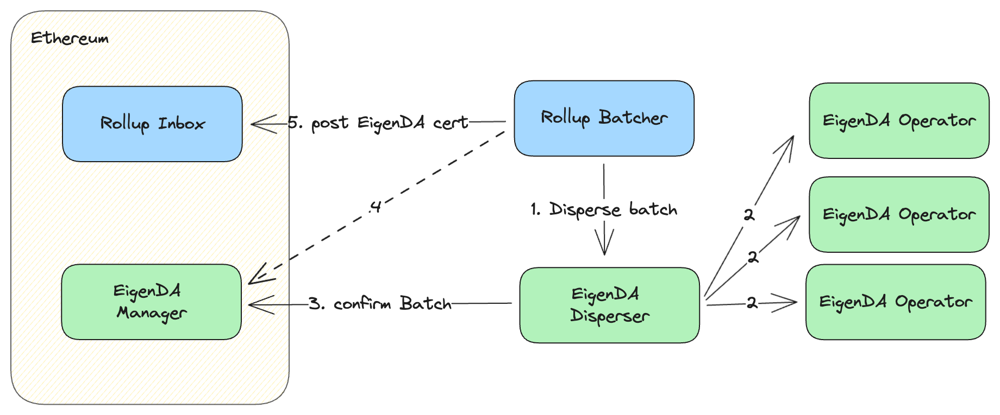
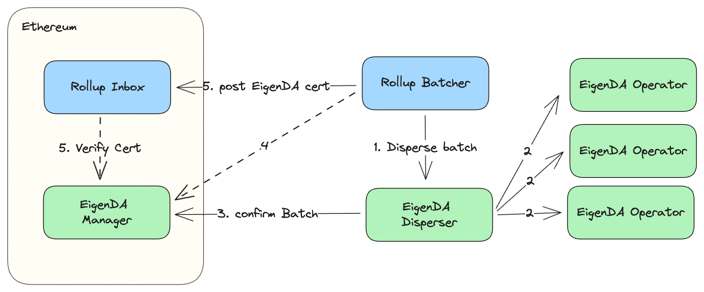
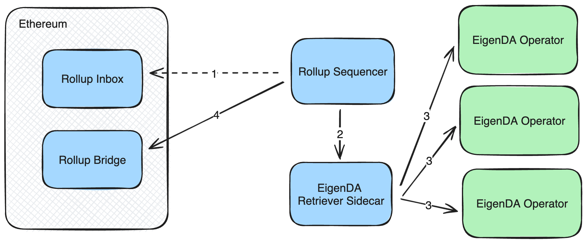
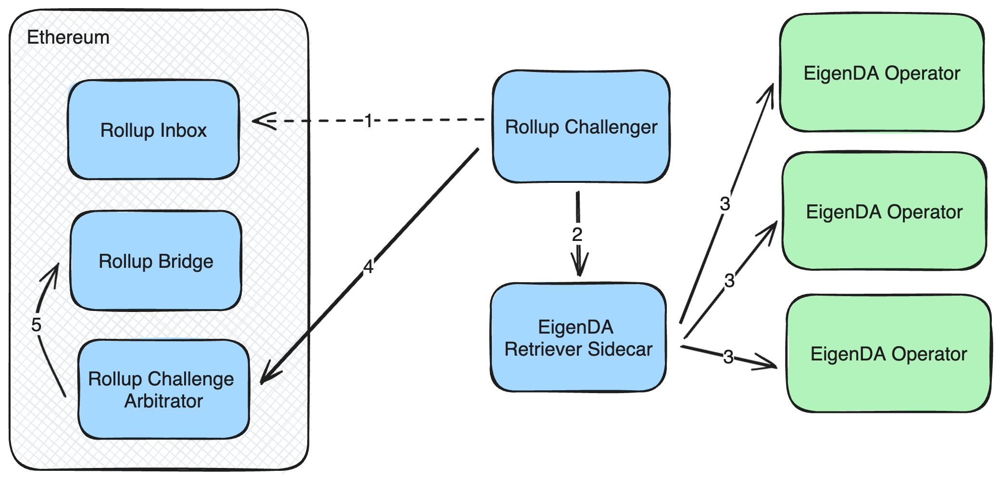

# Secure Integration 개요 (Overview)

이 문서는 안전한 EigenDA 통합이 어떤 모습인지 정리하여, rollup 엔지니어가 EigenDA 통합이 자신들의 tech stack과 보안 모델에 어떤 영향을 미치는지 잘 이해할 수 있도록 한다. 자세한 내용은 [EigenDA V2 integration spec](https://layr-labs.github.io/eigenda/integration/spec/6-secure-integration.html#certblobtiming-validation)을 참고한다.

> 참고: 각 rollup stack은 같은 개념을 조금씩 다른 용어로 부른다.
> 가능한 한 일반적인 용어를 사용하지만, 명확성을 위해 stack 특정 용어를 쓰기도 한다.

임의의 rollup에 대해, 외부 DA 통합에는 본질적으로 다섯 가지 주요 관심사가 있다:

1. **Dispersal.** rollup batcher는 transaction batch를 DA 레이어에 기록하고, 확정을 기다린 뒤, 그 결과로 나온 DA certificate를 [rollup inbox][glossary-rollup-inbox]에 기록해야 한다.
2. **Certificate Verification.** rollup inbox contract 또는 rollup OS는 DA cert의 데이터를 DA 레이어에서 읽기 전에, 충분한 operator가 해당 blob을 available로 인증했는지 등을 포함해 DA certificate가 유효한지 검증해야 한다. 이는 무효한 certificate로 참조된 transaction batch가 실행되지 않도록 보장한다.
   1. **Certificate Punctuality (Timing) Verification.** certificate는 어떤 punctuality window 내에 batcher inbox에 게시되어야 한다.
    EigenDA blob은 2주 동안만 다운로드 가능하므로, 악의적인 sequencer가 blob 삭제 직전에 certificate를 게시하는 것을 막기 위해 이 검증이 필요하다.
3. **Retrieval.** rollup full node는 L2 derivation/challenge 과정의 일부로 EigenDA blob을 retrieve해야 한다. 그렇지 않으면 L2 state를 따라갈 수 없다.
4. **Blob Commitment Verification.** rollup의 fraud arbitration protocol은, state root 생성에 사용된 모든 EigenDA blob이 rollup inbox에 게시된 EigenDA cert의 KZG commitment와 일치하는지 검증할 수 있어야 한다. 이 검증을 통해 chain은 rollup의 state root 생성에 사용된 transaction data가 sequencer/proposer에 의해 조작되지 않았음을 보장한다.

완전히 안전한 통합을 위해서는 위 3가지 검증이 모두 수행되어야 한다.

|               | Dispersal | Retrieval | Cert Verification | Blob Verification | Timing Verification |
| ------------- | --------- | --------- | ----------------- | ----------------- | ------------------- |
| Trusted       | x         | x         |                   |                   |                     |
| Fully Secured | x         | x         | x                 | x                 | x                   |

이 검증들을 구현하는 방식은 여러 가지가 있고, rollup stack마다 서로 다른 방식을 채택한다. 이 문서에서는 다양한 접근 방식을 정리한다.

## Trusted Integration (Dispersal+Retrieval) {#trusted-integration}

trusted integration은 sequencer가 cert를 검증해 적시에 rollup inbox에 게시한다고 신뢰한다.
이 통합은 단순함을 위해 dispersal과 retrieval에 초점을 맞추지만 보안을 일부 희생한다. L2 batch의 lifecycle을 따라가 보자:

1. rollup sequencer의 batcher 컴포넌트가 L2 batch를 준비하고 EigenDA disperser의 **DisperseBlob()** rpc를 호출해 batch data를 보낸다.
2. disperser는 blob을 chunk로 erasure encoding하고, KZG commitment를 계산하며 각 chunk에 대한 KZG proof를 계산한다. 그리고 각 operator가 자신의 stake에 비례해 chunk의 일부를 받도록 EigenDA operator set에 chunk를 분배한다. 각 operator는 받은 chunk가 KZG proof와 KZG commitment에 부합하는지 확인하고 저장한다. 부합하면 chunk가 저장되었음을 증명하는 메시지에 서명해 disperser에 반환한다.
3. disperser는 step 3에서의 서명들을 단일 BLS signature로 집계해 일부 blob 메타데이터와 함께 Ethereum의 EigenDA Manager contract에 보낸다. Ethereum의 EigenDA Manager contract는 EigenDA certificate 검증을 담당하며, 검증되면 storage에 그 검증을 기록한다. 검증은 집계된 서명이 유효하고 현재 EigenDA operator set에 기반한 것인지 확인하는 것으로 이뤄진다. 이 통합 전략에서는 이 blob verification status를 사용하지 않는다.
4. sequencer가 EigenDA disperser를 사용하는 경우, disperser가 blob이 성공적으로 dispersal되었다고 말한다고 해서 무조건 신뢰해서는 안 되고 onchain 확인을 통해 검증해야 한다. 이 통합 전략에서는 rollup inbox가 이 검증을 수행하지 않으므로 이 단계가 중요하다. 이 검증이 없으면 EigenDA disperser가 (sequencer에 더해) 신뢰의 대상이 된다.
5. batcher는 EigenDA blob id를 calldata로 갖는 transaction을 Ethereum의 rollup inbox contract로 보내고, 이는 EigenDA blob id를 받아들인다.

derivation 측면에서는 비슷한 흐름이 반대로 일어난다. L2 full node가 rollup inbox에서 EigenDA certificate를 만나면, EigenDA client를 사용해 EigenDA operator set으로부터 underlying blob을 retrieve하고, 그 안의 transaction들을 해석한다.

이 통합 모델은 *불안전*하다는 점에 유의해야 한다. 이 시나리오에서는 fraud proof system이 비활성화되어 state root에 도전할 수 없으므로 rollup sequencer가 완전히 신뢰의 대상이 된다. 즉 sequencer는 자신이 원하는 state root를 bridge contract에 게시할 수 있고, 잠재적으로 자금을 탈취할 수 있다.

## Cert Punctuality Verification

EigenDA blob은 2주 동안만 다운로드 가능하므로, [batcher][glossary-batcher]가 blob 삭제 이후에 EigenDA cert를 rollup inbox에 게시하지 않도록 보장하는 것이 중요하다. 안전하게 통합된 rollup stack은 자신의 derivation pipeline에서 정의된 [cert-punctuality-window][glossary-cert-punctuality-window]를 가져야 한다.

## Cert Verification

cert validity 규칙은 EigenDACertVerifier contract에 인코딩되어 있다. 따라서 cert validity는 eth-call로 offchain에서 확인하거나, 해당 method 호출로 onchain에서 확인할 수 있다. storage proof를 통해 zk로 증명할 수도 있다. 자세한 내용은 [V2 integration spec][spec-cert-validation]을 참고한다. 궁극적으로는 L1 chain이 cert가 유효함을 납득해야 하며, 이는 다음 두 방식 중 하나로 이뤄질 수 있다:
1. Pessimistic
   1. 모든 blob에 대해 [rollup-inbox][glossary-rollup-inbox] contract에서 검증 (optimistic rollup)
   2. state transition correctness proof와 함께 집계 및 제출되는 zk proof 생성 (zk rollup)
2. Optimistic: fraud가 발생하는 경우의 one step proving 시점에만 검증 (optimistic rollup)

pessimistic 구현이 더 단순하지만, 검증이 sequencer가 부정직할 때만 onchain 비용을 유발하므로 optimistic 접근이 종종 더 바람직하다.

### Pessimistic Cert Verification

여기서는 inbox 검증 전략만 설명한다. 비교적 간단하기 때문이다. storage에 대한 zk proof를 얻는 방법은 여러 가지가 있으므로, 이 접근을 사용하려는 팀은 자신들이 사용하는 stack의 가이드를 참조해야 한다.

> 참고: 이 전략은 [rollup-inbox][glossary-rollup-inbox]가 contract인 rollup stack(예: arbitrum nitro)에서만 가능하다. op stack에서는 batcher inbox가 EOA이므로 ([eip-7702](https://github.com/ethereum/EIPs/blob/master/EIPS/eip-7702.md)를 사용하지 않는 한) DACertVerifier를 호출할 수 없다.

L2 inbox certificate 검증 전략을 이해하는 한 가지 좋은 방법은, L2 transaction을 발생부터 Ethereum 상의 finalization까지 따라가 보는 것이다. 이를 다시 두 단계, 즉 L2 chain finalization과 L2 bridge finalization으로 나눌 수 있다.

**L2 Chain Finalization**

먼저 L2 chain finalization. L2 transaction은 finalized된 L1 block의 [rollup-inbox][glossary-rollup-inbox]에 포함되었을 때 L2 chain에 대해 finalized된다. 이 과정이 끝나면 어떤 L2 node든 그 transaction이 canonical L2 chain의 일부이며 reorg 대상이 아님을 자신할 수 있다. 예를 들어, 안전한 rollup에서 USDC로 차량 대금을 받아 차를 파는 경우라면, 차를 인도하기 전에 transaction이 L2 chain finalization에 도달했는지 기다리는 것이 중요하다.

위 다이어그램은 [위](#trusted-integration)의 trusted integration 다이어그램과 동일하나, 두 가지 약간의 수정이 있다:

4. 완전히 안전한 통합을 위해, batcher는 confirmBatch tx가 onchain에 finalized된 후에 EigenDA cert를 [rollup inbox][glossary-rollup-inbox]에 게시해야 한다. 이는 L1 chain reorg가 batch는 inbox에 남기되 eigenDA cert를 제거/무효화하는 상황을 막기 위해 필요하다.
5. rollup inbox contract는 EigenDA certificate가 유효하지 않으면 받지 않도록 프로그래밍되어 있다. cert는 `verifyDACert()` 함수 호출로 검증된다.

이 시점에서 사용자의 transaction은 rollup에서 confirmed된 상태다. weak subjectivity window (2 epoch ~= 13분)가 지나면 사용자의 transaction은 finalized된 것으로 간주할 수 있다.

**L2 Bridge Finalization**

L2에서 L1으로 자산이나 데이터를 bridging하려면 L2 bridge finalization이 필요하다. bridge finalization은 L1의 rollup bridge contract가 정확한 L2 state root에 도달하는 것에 의존한다. 이때 fraud proof 또는 validity proof가 등장한다.

모든 L2 full node는 L1으로부터 L2의 state root를 도출할 책임이 있다. 부정행위가 없는 경우 EigenDA를 이용한 이 과정은 비교적 단순하다:

1. L2 full node가 rollup inbox에서 EigenDA cert를 읽는다면, 그렇지 않으면 inbox에서 거부되었을 것이므로 그 DA cert가 유효함을 안다. 따라서 EigenDA client를 사용해 EigenDA cert로 EigenDA blob을 retrieve한다.
2. full node는 현재 L2 state를 기반으로, L2 blob에 기술된 L2 block을 실행한다.
3. full node가 proposer/validator라면, 몇 block마다 L2 state의 state root를 Ethereum의 rollup bridge contract에 게시한다.
4. challenge window (~7일) 내에 fraud proof가 제출되지 않으면, rollup bridge contract의 state root는 유효한 것으로 간주되고 outbound 자산이나 메시지가 bridge contract에 의해 release된다.

fraud challenge가 발생한 경우 절차는 더 복잡하다. state root 생성을 위한 두 번째의 동등한 state transition function이 있는데, 이는 훨씬 느리지만 훨씬 더 엄밀한 fraud proof를 제공한다.

이 절차는 L2 state를 운영체제까지 갖춘 가상 머신으로 모델링한다. 이 가상 머신은 특수한 `ReadInboxMessage` opcode를 사용해 rollup inbox contract에서 메시지를 지속적으로 읽고 그에 따라 처리한다. inbox 메시지가 raw L2 transaction batch를 기술한다면 L2 OS는 이를 실행해야 함을 안다. inbox 메시지가 EigenDA cert를 기술한다면, L2 운영체제는 cert 안의 KZG commitment를 특수한 `ReadPreImage` opcode에 전달해 underlying data를 읽고, 반환된 메시지를 처리해야 함을 안다.

이 VM state transition function 절차는 EigenDA cert가 참조하는 정확한 데이터에 기반해 state root가 생성되었음을 엄밀히 증명할 수 있게 해 주므로 유용하다.

이를 설명하기 위해 proposer가 부정직한 시나리오를 따라가 보자:

> 참고: 이 절은 arbitrum nitro opcode 용어를 사용한다. OP는 preimage oracle과 통신하기 위해 [syscall](https://specs.optimism.io/fault-proof/index.html#pre-image-communication) opcode를 대신 사용한다.

1. proposer가 EigenDA cert를 만나서, EigenDA에서 정직하게 데이터를 읽는 대신 EigenDA cert의 KZG commitment에 commit되지 않은 다른 곳의 데이터를 읽기로 한다. 이 메시지를 실행한 결과로 state root를 생성하고, 이 state root를 rollup bridge contract에 게시한다.
2. challenger는 특정 L2 block에 대한 자신의 state root가 proposer가 bridge contract에 게시한 것과 다름을 발견하고, contract 호출로 challenge를 시작한다.
3. challenger와 defender는 disagreement의 범위를 좁혀가며 VM state transition function의 특정 opcode까지 좁힌다. 이 경우 challenge는 `ReadPreImage` opcode에 도전하기로 한다. 올바른 EigenDA가 읽혔어야 할 지점이기 때문이다.
4. challenger는 `ReadPreImage` opcode 실행에 필요한 VM state와, opcode가 올바르게 실행되었음을 증명하는 데 필요한 추가 data를 가지고 arbitration contract를 호출한다. 이 추가 data에는 읽혔어야 할 data chunk(한 번에 32 byte만 읽음)와, 그 data가 opcode가 호출된 KZG commitment와 일치함을 보여주는 KZG proof가 포함된다. arbitration contract는 data가 KZG commitment 및 proof와 일치하는지 확인한다.
5. 검증의 승자가 challenger라면 기존 state root는 challenger의 새 state root로 대체된다.

EigenDA 통합을 fraud proof와 함께 구현하려면, 하부의 rollup이 KZG commitment를 `ReadPreImage` opcode에 전달할 수 있도록 지원해야 한다. L2 VM 설계의 나머지 부분은 fraud arbitration을 위해 그대로 동작한다.

### Optimistic Cert Verification

V2 통합 전략은 기존 통합 전략과 비슷하나, EigenDA certificate가 dispute game에서 필요할 때만 Ethereum 상에서 검증된다는 차이가 있다.
이를 위해서는 L2 State Transition Function (STF) 내에서 cert가 검증되어야 한다.
이 모드에서는 rollup batcher가 무효한 EigenDA cert를 rollup inbox에 제출할 수 있다. L2 node가 이 무효한 DA cert를 해석해 폐기하기 때문이다. rollup proposer가 무효한 EigenDA cert가 참조하는 데이터로 state root를 제출하면, 그 state root에 대한 challenge에 성공할 수 있다.

이 통합 전략은 L2 STF가 EigenDA cert를 검증할 수 있는 능력에 의존하며, 이를 위해서는 현재 EigenDA operator set에 대한 인증된 view가 필요하다. 구체적으로, L2 STF는 Eigenlayer contract storage proof가 검증될 수 있도록 L1 state root에 접근할 수 있어야 한다.

## Blob Commitment Verification

rollup은 EigenDA로부터 받은 EigenDA blob이 cert의 KZG commitment와 일치하는지 확인해야 한다. 전체 검증 규칙은 [spec][spec-blob-validation]을 참고한다.

이를 위한 몇 가지 전략이 있다:
1. KZG commitment를 다시 계산해 cert의 것과 비교한다. 단순하지만 SRS point가 필요하다.
2. 누군가가 KZG commitment에 대한 opening proof를 제공하도록 한다. 자세한 내용은 이 [issue](https://github.com/Layr-Labs/eigenda/issues/1037)를 참고한다.
3. 일부 zk rollup의 경우, onchain에 게시되는 commitment가 다른 종류이므로 [equivalence 증명](https://notes.ethereum.org/@dankrad/kzg_commitments_in_proofs#The-trick)이 필요하다.

<!-- Link References -->
[glossary-rollup-inbox]: glossary.md#rollup-inbox
[glossary-batcher]: glossary.md#rollup-batcher
[glossary-cert-punctuality-window]: glossary.md#cert-punctuality-window

[spec-cert-validation]: https://layr-labs.github.io/eigenda/integration.html#cert-validation
[spec-blob-validation]: https://layr-labs.github.io/eigenda/integration.html#blob-validation
