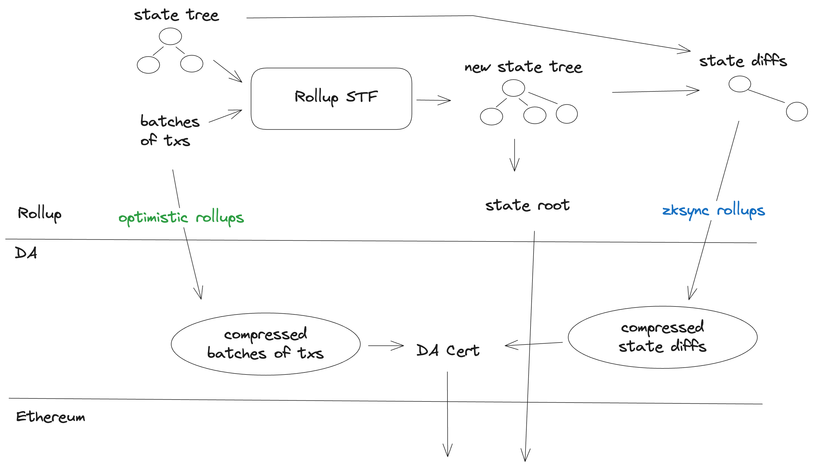
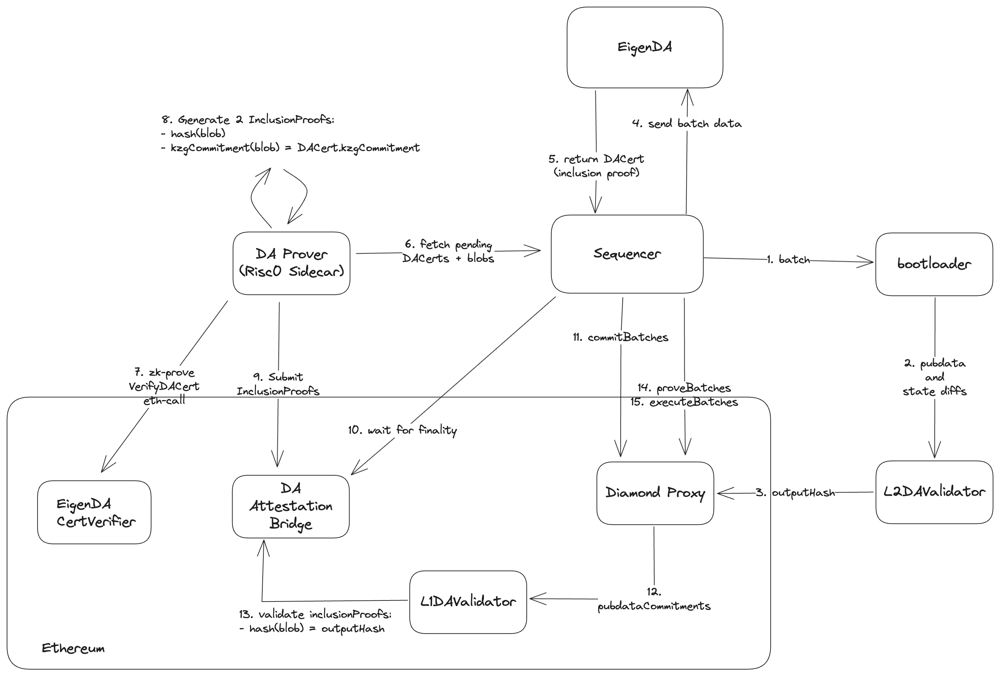

# ZK Stack 과 EigenDA

ZK Stack은 ZKsync의 rollup 프레임워크다. ZK Stack의 [validium architecture](https://docs.zksync.io/zk-stack/running/validium)에 따라 [EigenDA Client](https://github.com/matter-labs/zksync-era/tree/main/core/node/da_clients/src/eigen)를 구현했다. 우리의 통합은 현재 [Stage 1](#stage-1) 이고 [Stage 2](#stage-2)를 향해 작업 중이다.

## 개요

대부분의 다른 rollup stack과 달리, ZK Stack은 transaction batch가 아닌 압축된 state diff를 EigenDA에 게시한다. 동기와 기술 세부사항은 ZK Stack의 [Data Availability](https://docs.zksync.io/zksync-protocol/rollup/data-availability) 문서를 참고한다.

<!-- Image source: https://app.excalidraw.com/s/1XPZRMVbRNH/1fYTKbI9b4H -->


전반적으로 [transaction lifecycle](https://docs.zksync.io/zksync-protocol/rollup/transaction-lifecycle)은 변경되지 않으며, 데이터(압축된 state diff)가 EigenDA에 제출되고 DACert가 L1에 제출된다는 점만 다르다.

### Stage 1
> DA 레이어로 데이터를 보내기만 하고 그 inclusion은 검증하지 않는 Validium

ZK Stack은 sequencer를 sidecar 없이 단일 binary로 운영하는 것을 선호한다. 따라서 우리의 ZK Stack 통합은 [EigenDA Proxy](../../eigenda-proxy/eigenda-proxy.md)를 사용하지 않는다. 대신 우리의 Rust [eigenda-client](https://github.com/Layr-Labs/eigenda-client-rs)를 사용한다. ZKSync-Era repo 내부의 [EigenDA Client](https://github.com/matter-labs/zksync-era/tree/f05fffda72393fd86c752e88b7192cc8e0c30b68/core/node/da_clients/src/eigen) 래퍼는 [필요한 trait](https://docs.zksync.io/zk-stack/running/validium#server-related-details)의 두 method `dispatch_blob` 과 `get_inclusion_data` 를 구현한다.

### Stage 2
> DA 레이어로 데이터를 보내고 verification bridge나 zk-proof로 L1 상에서 그 inclusion을 검증하는 Validium

stage 2 모델에서는 ZK Stack의 prover가 AltDA에 종속되지 않도록, Validium 아키텍처가 EigenDA에 압축된 state diff가 inclusion되었음을 L1에 증명하는 sidecar prover 사용을 강제한다. 이 sidecar prover로는 Risc0를 사용한다.

<!-- Image source: https://app.excalidraw.com/s/1XPZRMVbRNH/9envZ9u54Sl -->


## 배포 (Deployment)

### 로컬 배포

Validium [FAQ](https://docs.zksync.io/zk-stack/running/validium#faq)의 단계를 따른다:
1. [이 가이드](https://github.com/matter-labs/zksync-era/tree/main/zkstack_cli)를 따라 `zkstack` 을 설치한다.
2. `zkstack dev clean all` - 빈 setup인지 확인한다.
3. `zkstack containers` - 필요한 docker container를 생성한다.
4. `zkstack ecosystem init` - 기본 ecosystem을 초기화한다 (모든 옵션을 default로).
5. `zkstack chain create` - 새 chain을 만든다. 기본 옵션을 유지하되, prompt에서 Validium을 선택하고 이 chain을 default로 사용한다 (마지막 질문).
6. `zkstack chain init` - 새 chain을 초기화한다.
7. 클라이언트를 설정한다 ([아래 절](#client-configuration) 참고).
8. `zkstack server --chain YOUR_CHAIN_NAME` - server를 실행한다.

### Production 배포

Production 배포는 로컬 배포와 비슷하게 진행한다. [eigenda client](#client-configuration) 설정이 필요하다. 자세한 내용은 ZK Stack의 [production deployment](https://docs.zksync.io/zk-stack/running/production) 문서를 참고한다.

### Client 설정

> 참고: 아래 문서는 오래되었을 수 있다. 진실의 출처는 ZKSync Era [EigenDA Client](https://github.com/matter-labs/zksync-era/tree/main/core/node/da_clients/src/eigen)와 그 [Config](https://github.com/matter-labs/zksync-era/blob/main/core/lib/config/src/configs/da_client/eigen.rs)다.

먼저 `etc/env/file_based/general.yaml` 파일의 `use_dummy_inclusion_data` 필드를 `true` 로 설정한다. 이는 Stage 2 통합이 완료될 때까지의 임시 해결책이다.

```yaml
da_dispatcher:
  use_dummy_inclusion_data: true
```

클라이언트는 `etc/env/file_based/overrides/validium.yaml` 의 `da_client` 필드를 수정해 설정할 수 있다.
수정 가능한 필드는 다음과 같다:

- `disperser_rpc` (string): EigenDA Disperser RPC server의 URL. 네트워크별 값은 우리 [docs](../../../networks/sepolia.md#specs)에서 확인할 수 있다.
- `operator_state_retriever_addr`: OperatorStateRetriever contract 주소. 이 주소는 [EigenDA Directory](../../../networks/sepolia.md#contract-addresses)에서 확인할 수 있다.
- `registry_coordinator_addr`: Registry Coordinator contract 주소. [EigenDA Directory](../../../networks/sepolia.md#contract-addresses)에서 확인할 수 있다.
- `cert_verifier_router_addr`: CertVerifierRouter contract 주소. 기본 CertVerifier를 배포해 두었으며 그 주소는 [EigenDA Directory](../../../networks/sepolia.md#contract-addresses)에서 확인할 수 있다. custom quorum이나 custom threshold를 원하는 팀은 [Custom Security](../../custom-security.md) 페이지를 참고한다.
- `eigenda_svc_manager_address` (string): service manager contract의 주소.
- `blob_version`: 사용할 BlobParams 버전을 지정한다. 현재는 0만 사용 가능하다. BlobVersion은 ThresholdRegistry contract에서 정의되며, 그 주소는 [EigenDA Directory](../../../networks/sepolia.md#contract-addresses)에서 확인할 수 있다.

예를 들어 sepolia EigenDA client를 사용하는 client 설정은 다음과 같다:

```yaml
da_client:
  client: Eigen
  disperser_rpc: https://disperser-testnet-sepolia.eigenda.xyz:443
  operator_state_retriever_addr: 0x22478d082E9edaDc2baE8443E4aC9473F6E047Ff
  registry_coordinator_addr: 0xAF21d3811B5d23D5466AC83BA7a9c34c261A8D81
  cert_verifier_router_addr: 0x17ec4112c4BbD540E2c1fE0A49D264a280176F0D
  blob_version: 0
```

:::note
batching 파라미터 설정 시, encoding 오버헤드와 비용 영향을 이해하기 위해 [batch sizing reference](https://github.com/Layr-Labs/eigenda/blob/master/encoding/utils/codec/README.md)를 참고한다.
:::

dispersal 비용을 지불할 계정의 private key를 포함하도록 `etc/env/file_based/secrets.yaml` 도 수정해야 한다. 다음 필드를 추가한다:

```yaml
da:
  client: Eigen
  private_key: <PRIVATE_KEY> # without the `0x` prefix
```
