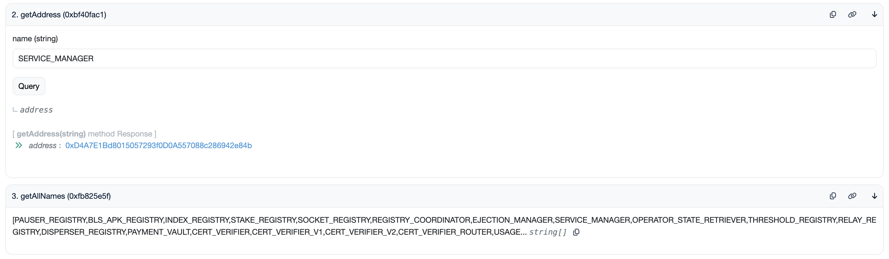

# Sepolia (테스트넷)

EigenDA Sepolia testnet은 통합용으로 현재 사용되는 EigenDA testnet이다.

## Quick Links (바로가기)

* [AVS Page][2]
* [Blob Explorer][1]

## 사양 (Specs)

| 속성 | 값 |
| --- | --- |
| Disperser Address | `disperser-testnet-sepolia.eigenda.xyz:443` |
| Max Blob Size | 16 MiB |

## Contract 주소

| Contract | Address |
| --- | --- |
| EigenDADirectory | [0x9620dC4B3564198554e4D2b06dEFB7A369D90257](https://sepolia.etherscan.io/address/0x9620dC4B3564198554e4D2b06dEFB7A369D90257) |

다른 모든 contract는 이제 EigenDADirectory contract 안에서 추적된다:
1. 위 etherscan 링크를 클릭한다.
2. "Contract" 버튼을 클릭한다.
3. "Read as Proxy" 버튼을 클릭한다.
4. "getAllNames()" 함수를 클릭하면 등록된 모든 contract의 이름을 볼 수 있다.
5. 이름을 사용해 "getAddress()" 함수로 특정 contract 주소를 얻는다.

## Quorum (쿼럼)

| Quorum Number | Token |
| --- | --- |
| 0 | LSTs |
| 1 | [WETH](https://sepolia.etherscan.io/token/0xf531b8f309be94191af87605cfbf600d71c2cfe0) |

[1]: https://blobs-v2-testnet-sepolia.eigenda.xyz/
[2]: https://sepolia.eigenlayer.xyz/avs/eigenda
