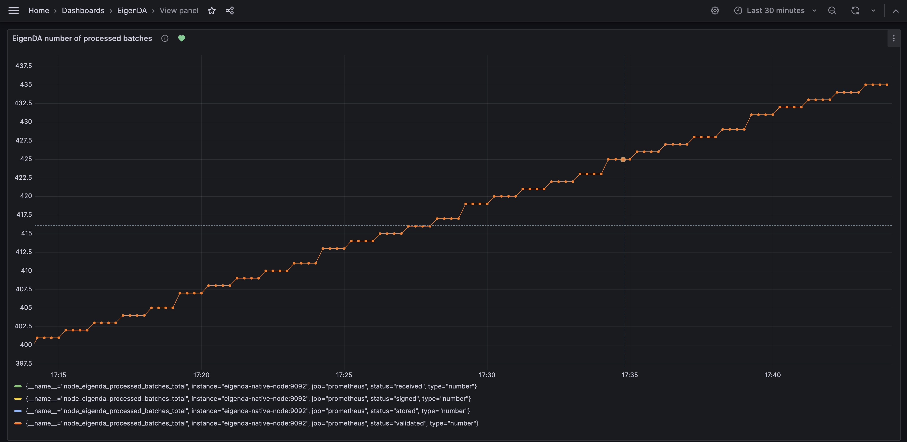

# 문제 해결 (Troubleshooting)


#### operator가 EigenDA set의 일원인지 어디서 확인하나?

다음 EigenLayer webapp 링크에서 검색할 수 있다:

* [Mainnet](https://app.eigenlayer.xyz/avs/0x870679e138bcdf293b7ff14dd44b70fc97e12fc0)
* [Hoodi](https://hoodi.eigenlayer.xyz/avs/eigenda)

#### EigenDA 운영을 위해 opt-in했는데 operator set에서 빠졌다. 무슨 일인가?

다른 operator에 의해 [churn out](registration-protocol.md#the-eigenda-churn-approver) 되었거나, [non-signing 사유로 ejection](./requirements/protocol-SLA/) 되었을 가능성이 있다. 둘 다 해당하지 않으면 EigenLayer Support에 문의한다.

#### node가 EigenDA blob을 올바르게 서명하고 있는지 어떻게 확인하나?

node가 blob을 서명하고 있는지 확인하는 방법은 몇 가지가 있다.

* [가이드](./metrics-and-monitoring/)에 따라 monitoring을 설정했는지 확인한다. 제공된 EigenDA Grafana dashboard를 추가한 뒤, **EigenDA number of processed batches** 그래프를 살펴본다. 이 그래프는 아래 그래프처럼 증가해야 한다:

 

* 아직 metrics를 설정하지 않았다면, EigenDA Node의 로그를 확인할 수도 있다. 정상적으로 서명 중이라면 로그가 [여기](./run-a-node/registration#check-for-network-traffic)에 보인 것과 비슷해야 한다.


### EigenDA opt-in 중 발생하는 오류

##### failed to request churn approval

```
Error: failed to opt-in EigenDA Node Network for operator ID: <OPERATOR_ID>, operator address: <OPERATOR_ADDRESS>, error: failed to request churn approval: rpc error: code = Unknown desc = failed to process churn request: registering operator must have 10.000000% more than the stake of the lowest-stake operator. Stake of registering operator: 0, stake of lowest-stake operator: 6301801525718228411481, quorum ID: 0
```

이는 operator가 EigenDA를 운영하기에 충분한 stake가 없기 때문이다. 이 오류에 대한 자세한 내용은 [EigenDA Churn Management](registration-protocol.md#the-eigenda-churn-approver)를 참고한다.

##### failed to reregister
```error: execution reverted: RegistryCoordinator._registerOperator: operator cannot reregister yet
{"time":"<TIME>","level":"ERROR","source":{"function":"github.com/Layr-Labs/eigenda/core/eth.(*Transactor). 
RegisterOperator","file":"/app/core/eth/tx.go","line":207},"msg":"Failed to register operator","component":"Transactor","err":"execution reverted: RegistryCoordinator._registerOperator: operator cannot reregister yet"}
```

ejection 후 재등록 cooldown은 mainnet에서 3일, testnet에서 1일이다. cooldown이 지난 뒤 재등록을 시도한다.

##### failed to read or decrypt the BLS/ECDSA private key

`.env` 파일의 `NODE_ECDSA_KEY_FILE_HOST` 와 `NODE_BLS_KEY_FILE_HOST` 변수가 올바르게 채워져 있는지 확인한다.

#### EigenDA node 로그가 다음과 같다. 무슨 의미인가?

```
INFO [01-10|20:49:53.436|github.com/Layr-Labs/eigenda/node/node.go:233]             Complete an expiration cycle to remove expired batches "num expired batches found and removed"=0 caller=node.go:233
INFO [01-10|20:52:53.436|github.com/Layr-Labs/eigenda/node/node.go:233]             Complete an expiration cycle to remove expired batches "num expired batches found and removed"=0 caller=node.go:233
INFO [01-10|20:55:53.436|github.com/Layr-Labs/eigenda/node/node.go:233]             Complete an expiration cycle to remove expired batches "num expired batches found and removed"=0 caller=node.go:233
INFO [01-10|20:58:53.436|github.com/Layr-Labs/eigenda/node/node.go:233]             Complete an expiration cycle to remove expired batches "num expired batches found and removed"=0 caller=node.go:233
INFO [01-10|21:01:53.436|github.com/Layr-Labs/eigenda/node/node.go:233]             Complete an expiration cycle to remove expired batches "num expired batches found and removed"=0 caller=node.go:233
INFO [01-10|21:04:53.437|github.com/Layr-Labs/eigenda/node/node.go:233]             Complete an expiration cycle to remove expired batches "num expired batches found and removed"=0 caller=node.go:233
INFO [01-10|21:07:53.436|github.com/Layr-Labs/eigenda/node/node.go:233]             Complete an expiration cycle to remove expired batches "num expired batches found and removed"=0 caller=node.go:233
INFO [01-10|21:10:53.436|github.com/Layr-Labs/eigenda/node/node.go:233]             Complete an expiration cycle to remove expired batches "num expired batches found and removed"=0 caller=node.go:233
INFO [01-10|21:13:53.436|github.com/Layr-Labs/eigenda/node/node.go:233]             Complete an expiration cycle to remove expired batches "num expired batches found and removed"=0 caller=node.go:233
INFO [01-10|21:16:53.436|github.com/Layr-Labs/eigenda/node/node.go:233]             Complete an expiration cycle to remove expired batches "num expired batches found and removed"=0 caller=node.go:233
```

이 로그에는 간헐적인 INFO 로그만 있고, Disperser로부터 새 blob을 적극 수신하고 있다는 로그가 없다. 정상 로그라면 "Validate batch took", "Store batch took", "Signed batch header hash" 같은 메시지가 포함되어야 한다.

이는 node software는 실행 중이지만 EigenDA에 opt-in되지 않은 상태임을 뜻한다.
EigenDA에 성공적으로 opt-in했는데도 dispersal 트래픽을 받지 못한다면, EigenDA의 disperser가 node에 도달할 수 있도록 네트워크 설정이 허용되어 있는지 확인한다. 네트워크 설정이 [권장 설정](./run-a-node/run-with-docker#network-configuration)과 일치하는지 확인한다.

이전에 opt-in되어 서명 중이었다면, 다른 operator에 의해 [churn out](registration-protocol.md#the-eigenda-churn-approver) 되었거나 [non-signing 또는 다른 SLA 위반으로 ejection](./requirements/protocol-SLA/)되었을 수 있다. 다시 opt-in을 시도한다.


#### "EIP1271 .. signature not from signer" 오류는 무슨 의미인가?

BLS key를 올바르게 import하지 않았다는 뜻이다. import한 key를 다시 확인해 오타나 실수가 없는지 점검한다.

#### 오류 메시지 "failed to update operator's socket .. execution reverted"

"msg="failed to update operator's socket" !BADKEY="execution reverted: RegistryCoordinator.updateSocket: operator is not registered"

이는 RPC endpoint가 정상 동작하지 않거나, operator 설정이 잘못되었거나 (예: 잘못된 chain_id 값), operator가 등록되어 있지 않다는 뜻이다.

다음 명령으로 RPC endpoint를 점검한다: `curl -I [rpc_url]`.
- 400대 응답은 서버가 다운되었음을 의미한다(접근 불가).
- 200대 응답은 서버가 정상 동작 중임을 의미한다.
