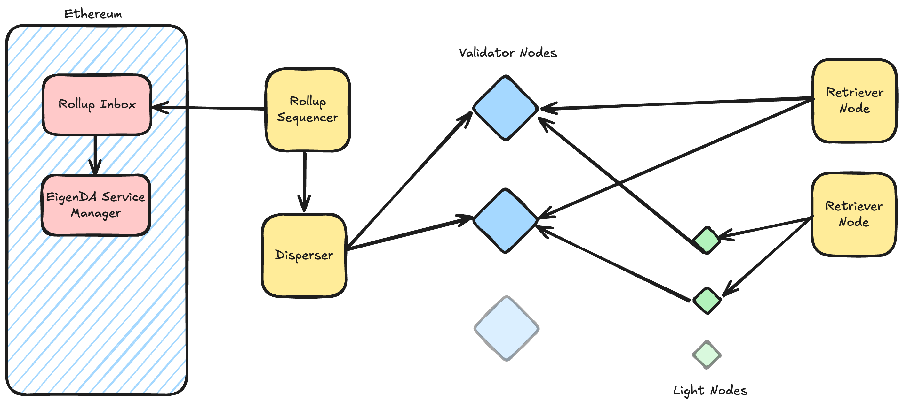

# What is EigenDA?

EigenDA는 Eigen Labs가 개발하고 EigenLayer 위에 구축된 data availability 프로토콜이다. rollup용으로는 Mainnet과 Sepolia testnet에서, operator용으로는 Hoodi에서 가동 중이다.

EigenDA는 처음부터 최적의 scalability와 efficiency를 갖도록 설계되어, 다른 솔루션이 도달할 수 없는 throughput과 cost로 DA를 제공할 수 있게 한다.

## What Makes EigenDA Different?

### The most scalable DA layer

blockchain trilemma는 scalability, security, decentralization가 항상 충돌함을 시사한다. Layer 2 rollup은 블록체인의 compute 기능을 off-chain으로 옮겨 거의 임의로 확장할 수 있고, 블록체인에는 작은 verification footprint만 남길 수 있음을 보여줌으로써 — 그러면서 trilemma의 다른 두 축을 훼손하지 않으면서 — 이 trilemma가 전달하는 직관에 도전한다.

EigenDA는 블록체인의 data availability (DA) 기능에 대해서도 같은 maneuver가 가능하다는 깨달음에서 탄생했다. data availability를 non-blockchain 구조로 옮기면, security나 decentralization을 전혀 양보하지 않고도 완전한 scalability가 가능하다.

이런 의미에서, EigenDA는 Ethereum의 Layer 2 scaling 로드맵의 완성을 의미한다. Layer 2 rollup과 EigenLayer Actively Validated Service 같은 다른 패턴들은 다양한 형태의 compute에 대해 scalability를 제공할 수 있고, EigenDA는 DA에 대해 scalability를 제공함으로써, application 전 영역이 Web2 규모에서 안전하게 검증될 수 있게 한다.

EigenDA는 performance, security, cost 차원 모두에서 optimality 또는 near-optimality를 유지하는 우아한 architecture를 활용한다.

- EigenDA는 KZG polynomial opening proof로 암호학적으로 검증되는 Reed Solomon encoding을 통해 *information-theoretically minimal data overhead*를 얻는다.
- *Security at scale* — committee 기반 sharding 방식과 달리, EigenDA에서는 동일한 데이터가 노드에서 두 번 저장되지 않는다. byte당 redundancy를 최대화함으로써 EigenDA는 데이터 저장 및 전송 비용 대비 이론적으로 최적인 보안 속성을 달성한다.
- *Scalable unit economics* — EigenDA의 총 데이터 전송량은 (완전히 신뢰되는 환경 가정 시) 이론적 최소치의 10X 안에 들어오는 반면, 경쟁 시스템의 전송량은 validator와 full node 수에 따라 100X 이상으로 증가할 수 있다.

자세한 내용은 아래의 Optimal DA Sharding 섹션을 참고하라.

### Ethereum-based Security

EigenDA의 보안 접근 방식은 ETH의 깊이와 EIGEN의 forkability를 활용하며, rollup 같은 고객의 native staking 토큰을 사용하도록 커스터마이즈할 수 있다.

경쟁자들은 자체 sidechain 토큰만으로 워크로드를 보호하지만, EigenDA는 restaked ETH를 사용하면서도 L2가 EIGEN과 자체 native 토큰(Custom Quorum을 통해)으로 Ethereum의 보안을 보강할 수 있게 한다.

Ethereum 기반 L2에 이런 보안 접근 방식은 여러 이유로 유리하다.

- EigenDA는 Ethereum staker가 EigenLayer를 통해 restake하여 추가 yield를 얻고, EigenDA 프로토콜 보안에 기여한 대가로 EigenDA reward를 얻을 수 있게 함으로써 Ethereum 생태계로 다시 환원된다(2025년 3월 기준, EigenDA는 launch 시점에 4.3M ETH staked, 즉 수십억 달러 규모의 economic security를 보유). 이는 더 많은 활동이 Layer 2 chain으로 이동함에 따라 EigenDA가 Ethereum의 경제를 뒷받침하는 데 기여함을 의미한다.
- EigenDA는 settlement layer와 operator set 관리를 위해 Ethereum을 native로 사용하므로, Ethereum에 정산하는 L2는 safety나 liveness를 위해 다른 chain의 bridge에 의존할 필요가 없으므로 EigenDA가 향상된 보안을 제공한다.
- EigenDA는 다른 DA 솔루션의 censorship attack에 특히 민감한 Ethereum의 based rollup에 특히 적합한 독특한 censorship resistance 속성을 갖는다. 특히, 경쟁자들은 트랜잭션을 검열할 수 있는 consensus leader를 가지지만, EigenDA의 새롭고 leader-free한 설계는 추가 censorship vector를 거의 또는 전혀 도입하지 않는다(참고: 이 기능은 2025년 Q2 예정).

### Unparalleled Control

Actively Validated Service (AVS)로서 EigenDA는, 확장 가능하고 customizable한 verifiable cloud primitive의 완전한 생태계를 구축함으로써 modular blockchain thesis를 완성하려는 EigenLayer의 미션에 참여한다.

원칙적으로 EigenDA는 고객을 위한 가치 부가 customization을 지원하기 위해 필요에 따라 fork·수정·재배포할 수 있는 AVS의 archetype을 나타낸다. 실제로는 AVS 형식의 본질적 단순성과 유연성 덕분에 그러한 많은 customization이 out-of-the-box로 제공된다.

**Pay how you want**

- ETH, EIGEN, 또는 자체 native 토큰으로 결제. 이런 결제 유연성을 허용하는 유일한 DA 프로토콜이 EigenDA다.
- *cost forecasting 향상* — reserved bandwidth로 사전 구매. L1 blob과 Celestia가 모두 fee market인 것과 달리, EigenDA는 네트워크의 다른 활동과 경쟁(혼잡해지면 느리고 비싸짐)하는 대신 고정 가격과 bandwidth reservation을 제공한다.

**Customize DA security**

- *Custom Quorum* — rollup의 토큰을 stake해 EigenDA를 보호. EigenDA는 rollup이 자체 native 토큰으로 EigenDA 사용을 보호할 수 있는 능력을 독점적으로 제공하여 추가 보안 layer를 제공한다.

**Unlock liquidity incentives**

- EigenLayer의 ULIP 프로그램으로 staker를 유치.

# How EigenDA Works

## Architecture

EigenDA architecture는 여러 핵심 컴포넌트로 구성된다.

- **Validator nodes**: blob의 availability에 attest하고, retrieval node(궁극적으로는 light node)에게 해당 blob을 제공할 책임이 있다. Validator node는 EigenLayer에 stake되어 있어야 하며, 위임받은 stake asset에 대응하는 EigenDA operator set에 등록되어야 한다. 각 validator node는 프로토콜이 처리하는 각 blob의 일부분만 검증·저장·제공한다.
- **Dispersers**: 데이터를 인코딩해 validator node에게 전달한다. Disperser는 데이터 인코딩의 정확성을 증명하는 proof를 생성해 함께 전달해야 한다. 또한 disperser는 validator node로부터 availability attestation을 집계하며, 이는 rollup 같은 use-case를 지원하기 위해 on-chain으로 bridge될 수 있다.
- **Retrieval nodes**: validator node로부터 데이터 shard를 수집해 디코딩하여 원본 데이터 컨텐츠를 만들어낸다.
- **Light nodes** (Planned): light node는 observability를 제공해, validator node가 retrieval node에게 데이터를 withhold하더라도 그 withholding이 광범위하게 관찰 가능하도록 한다.

EigenDA architecture는 각 컴포넌트가 자기 고유 작업에 특화될 수 있도록 heterogeneous하게 구성된다. Disperser는 탈중앙화된 service provider로 운영될 수도 있고, rollup sequencer나 다른 데이터 originator를 위한 전용 side-car로 운영될 수도 있다.

consensus leader에 의존하지 않고 네트워크에 직접 disperse할 수 있는 능력은 EigenDA에 독특한 censorship resistance 속성을 부여한다. 대부분의 블록체인에서 consensus leader는 일방적으로 censor할 수 있지만, EigenDA에서는 blob을 censor하려면 프로토콜의 liveness threshold를 초과하는 stake를 가진 validator node 집합이 그 blob을 거부해야 한다.

## **Optimal DA sharding**

EigenDA architecture의 핵심 아이디어는, 모든 노드가 시스템에 의해 보호되는 모든 데이터를 저장할 필요는 없다는 것이다. scalability를 개선하기 위해 네트워크의 sub-committee나 shard 사이에 작업을 "sharding"하는 것은 블록체인 시스템에서 흔한 아이디어이지만, 종종 보안을 훼손하는 순진한 방식으로 이뤄진다.

EigenDA는 블록체인이 아니며 VM 실행처럼 데이터의 의미적 컨텐츠에 작용하는 작업을 수행하지 않으므로, 완전 복제 시스템의 보안 속성을 보존하는 erasure coding scheme을 통한 최적화된 sharding 전략을 사용할 수 있다.

EigenDA는 Reed Solomon erasure coding을 사용한다. 이는 information-theoretically optimal reconstruction 속성을 제공하는데, 즉 인코딩된 데이터 shard 중에서 그 총 크기가 원본 unshard 항목의 크기 이상인 임의의 unique 모음으로 원본 항목을 복원할 수 있다는 의미다.

각 validator node는 자신이 위임받은 stake에 비례하는 크기의 unique shard를 받는다. 즉, stake 비율 $\alpha_i$를 가진 operator $i$는 원본 data blob의 $\alpha_i / \gamma$ 비율 크기의 shard를 받으며, 여기서 $\gamma$를 coding rate라 한다. 결과적으로 총 위임 stake의 $\gamma$ 비율을 집합적으로 가진 어떤 operator 집합도 원본 blob을 재구성할 수 있다 — 그들의 shard 크기 합이 원본 blob 크기의 $\gamma/\gamma = 1$ 비율이 되기 때문이다.

coding rate $\gamma$는 시스템의 총 "overhead"를 특징짓는다. operator들에게 보내지는 데이터의 총 크기가 인코딩되지 않은 데이터의 $\sum_i{\alpha_i}/\gamma = 1/\gamma$ 배이기 때문이다. coding rate $\gamma$는 또한 Byzantine safety 및 liveness threshold와도 관련이 있으며, 다음과 같이 정의된다.

- Safety threshold, $\eta_S$: 적이 safety 실패를 일으키기 위해 통제해야 하는 stake 비율.
- Liveness threshold, $\eta_L$: 적이 liveness 실패를 일으키기 위해 통제해야 하는 stake 비율.

프로토콜은 $1 - \eta_L - \eta_S \ge \gamma$를 만족해야 한다. 즉, adversary threshold 54%, liveness threshold 33%일 때 시스템의 총 data overhead는 8X 미만이 될 수 있다(다른 시스템과의 비교는 아래 섹션 참고).

EigenDA는 disperser가 생성한 KZG polynomial commitment와 opening proof를 사용해, validator node·light node·full node가 자신의 shard 무결성과 Reed Solomon encoding 동작의 정확성을 검증할 수 있게 한다.

# Comparative Analysis

다음 표는 EigenDA를 인기 있는 대안들과 performance, security 측면에서 비교한 것이다.

|  | EIP-4844 | Celestia | EigenDA                                                |
| --- | --- | --- |-------------------------------------------------------------------|
| Throughput | 1MB/s | 1MB/s | 100 MB/s                                                           |
| 노드당 평균 다운로드 대역폭 요구량 | 25 MB/s | 1GB/s | 1 MB/s                                                            |
| Throughput Scaling | 0.04 | 0.001 | 15                                                                |
| Overhead (저장, 다운로드 대역폭*) | $\mathcal{O}(n)$** | $\mathcal{O}(n)$** | $c=8$                                                             |
| Latency | 12s | 12s | 5s average, 10s at p99                                            |
| Safety Threshold | 1/3 of ETH Stake | 1/3 of Celestia Stake | 1/3 of ETH restaker + 1/3 of EIGEN stake (+ 1/3 of custom token) |

*rollup 같은 일반적인 use case의 경우, 시스템의 속성은 DA layer와 상호작용하는 비교적 적은 수의 rollup full node에 의해 유지된다. 이 경우 다운로드 대역폭이 시스템 성능의 병목이다. EIP-4844와 Celestia 같은 시스템은 P2P 네트워크를 통한 데이터 전파에 업로드 대역폭을 활용할 수 있는 반면, EigenDA는 데이터 소비자에게 데이터를 제공하는 데에만 업로드 대역폭을 사용한다.

**대부분의 기존 블록체인(Ethereum, Celestia, Solana 등)은 네트워크 안의 모든 노드 사이에 block을 gossip한다. 즉, block을 사용 가능하게 만드는 총 비용은 노드당 처리 비용에 노드 수를 곱한 것과 같다. 실제로는 노드당 처리 비용을 부풀리는 P2P overhead도 존재한다.
