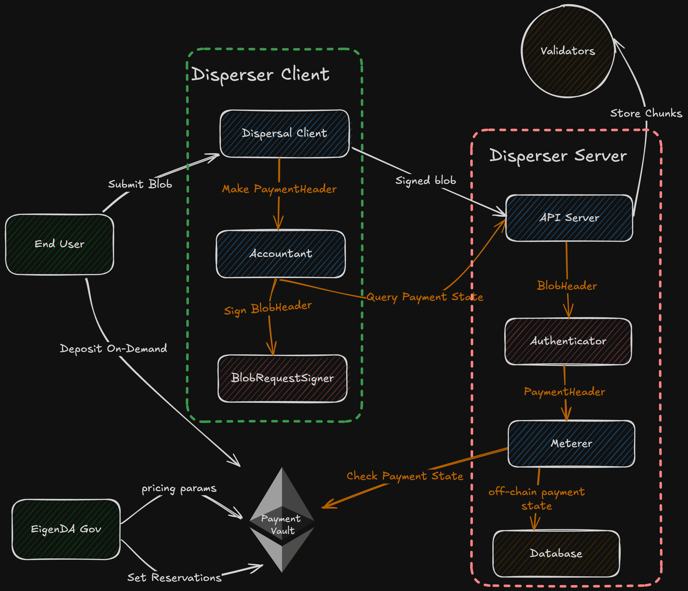
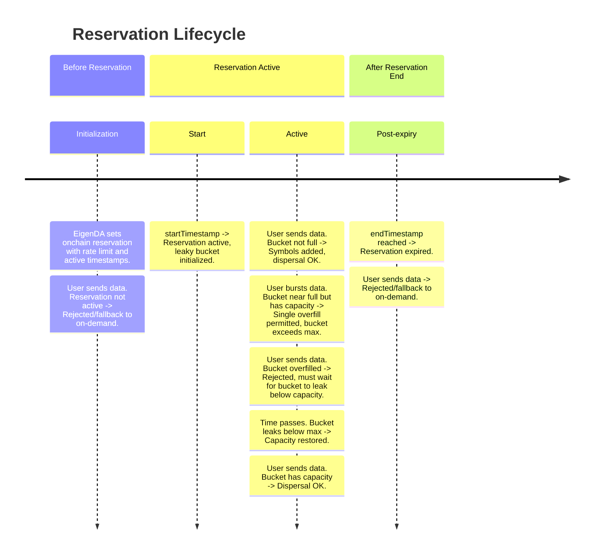
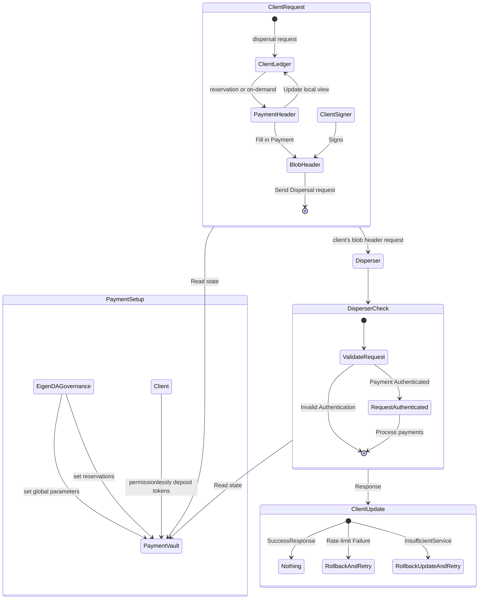

# 결제 시스템 (Payments)

Payments 시스템은 EigenDA와의 사용자 상호작용을 간소화하며, 네트워크 bandwidth를 관리하는 명확하고 유연한 옵션을 제공한다. EigenDA는 두 가지 유연한 payment modality를 지원한다.

1. **On-demand Bandwidth**: 사용자는 시간 제한이나 throughput 보장 없이 가끔의 bandwidth 사용에 대해 blob dispersal request마다 과금된다. 과금은 disperser server가 요청을 성공적으로 검증할 때만 적용되어, dynamic bandwidth 요구사항을 가진 사용자에게 유연성을 제공한다.

2. **Reserved Bandwidth**: 사용자는 시스템 capacity를 미리 결제함으로써 고정된 기간 동안 bandwidth를 reserve할 수 있어, 할인된 가격으로 일관되고 안정적인 throughput을 보장한다.

시스템은 accounting과 metering을 모두 처리하는 중앙화된 disperser를 통해 투명한 가격 책정과 metering을 지원한다. 현재 설계는 효율적인 bandwidth 할당과 분배를 위해 disperser에 대한 신뢰를 가정한다.

## 설계 목표 (Design Goals)

payments 업그레이드의 전반적 목표는, EigenDA validator network에 대한 permissionless dispersal을 지원하기 위해 우아하게 확장될 수 있는 방식으로 EigenDA에 유연한 payment modality를 도입하는 것이다.

### On-Demand Bandwidth (온디맨드 대역폭)

on-demand bandwidth는 사용자가 가끔 사전 결제(pre-paid)하고 blob 요청마다 과금되도록 한다. 특정 시간 제한이나 throughput 보장은 없다. 이 접근은 예측 불가능한 bandwidth 요구를 가진 사용자에게 이상적이다. `PaymentVault` 컨트랙트를 통해 사용자는 `depositOnDemand` 함수로 자금을 deposit할 수 있다. 과금은 dispersal request가 성공적으로 처리된 후에만 적용되어, dynamic bandwidth 사용 패턴을 위한 유연하고 효율적인 솔루션을 제공한다.

on-demand payments는 현재 EigenDA Disperser를 통해서만 지원된다. 사용자는 disperser로부터 자신의 현재 on-demand 잔고를 retrieve할 수 있어, 사용 가능한 자금을 효과적으로 모니터링하고 향후 bandwidth 사용을 계획할 수 있다.

### Reserved Bandwidth (예약 대역폭)

reserved bandwidth는 정의된 기간 동안 일관된 bandwidth를 고객에게 제공한다. EigenDA `PaymentVault` 컨트랙트는 기존 reservation 기록을 유지하며, 각 reservation은 bandwidth 허용량, 적용 기간 등을 명시한다.

reservation이 onchain으로 생성되면, 컨트랙트의 `setReservation` 함수를 통해 업데이트할 수 있다. 이 함수는 사용자에 대한 reservation을 관리·유지하기 위해 EigenDA governance가 호출한다.

reservation의 적용 기간 동안, 사용자 client는 이러한 reservation 중 하나와 연관된 계정으로 인증된 dispersal request를 보낼 수 있다. 이 요청은 leaky bucket rate limiting 알고리즘의 적용을 받으며, blob이 dispersal될 때마다 symbol이 추가되고 reservation rate에 따라 시간이 지나면서 symbol이 새어나간다. bucket에 사용 가능한 capacity가 있는 한 요청이 받아들여진다.

## 상위 수준 설계 (High-level Design)

payment 시스템은 다음 컴포넌트로 구성된다.

- **Users**: on-demand 결제를 위해 permissionless하게 토큰을 deposit하거나, EigenDA 팀과 reservation을 협상한다.
- **EigenDA Client**: 사용자는 client 인스턴스를 실행해 dispersal용 데이터를 제출하고 결제를 관리한다(이 client는 EigenDA proxy에 통합되어 있다).
- **Disperser Server**: 데이터를 dispersal하고 on-demand 결제 사용량을 추적할 책임이 있다.
- **Validator Nodes**: reservation metering의 source of truth로서, leaky bucket rate limiting을 통해 reservation 사용량을 추적한다.
- **Payment Vault**: on-demand 결제와 reservation 관리를 위한 onchain smart contract.
- **EigenDA Governance**: EigenDA governance 지갑이 payment vault의 전역 파라미터와 reservation을 관리한다.




dispersal을 시작하려면 EigenDA client가 payment header를 담은 dispersal request를 disperser로 보내고, disperser가 결제 정보를 검증한다. on-demand 결제의 경우 disperser는 사용량을 추적하고 `PaymentVault` 컨트랙트의 deposit과 비교해 검증한다. reservation 결제의 경우 validator node가 source of truth 역할을 하며, leaky bucket rate limiting을 사용해 각 계정의 reservation 사용량을 추적한다. client는 disperser에게 쿼리해 자신의 on-demand 사용량 정보에 대한 offchain 상태를 retrieve할 수 있다.

## 상세 명세 (Low-level Specification)

### On-Demand Bandwidth (온디맨드 결제, On-Demand Payments)

on-demand payments는 EigenDA Disperser를 통해서만 지원되며, disperser가 사용량을 추적하고 결제를 검증한다.

disperser client가 만든 요청은 `BlobHeader`를 담고, 이는 아래에 명시된 `PaymentMetadata` struct를 포함한다.

```go
// PaymentMetadata represents the payment information for a blob
type PaymentMetadata struct {
  // AccountID is the ETH account address for the payer
  AccountID string
  // Timestamp represents the nanosecond of the dispersal request creation (serves as nonce)
  Timestamp int64
  // CumulativePayment represents the total amount of payment (in wei) made by the user up to this point.
  // If empty/zero → reservation payment
  // If non-zero → on-demand payment
  CumulativePayment *big.Int
}
```

on-demand bandwidth 사용자는 먼저 특정 계정에 대해 payment vault 컨트랙트로 토큰을 deposit해야 한다. 컨트랙트는 그 계정에 deposit된 총 결제액(`totalDeposit`)을 저장한다. 사용자는 현재 `PaymentVault` 컨트랙트에서 출금이나 환불을 요청할 수 없으므로 deposit에 신중해야 한다. 사용자는 `GetPaymentState` gRPC endpoint를 호출해 disperser로부터 현재 on-demand 잔고를 retrieve할 수 있다.

```solidity
// On-chain record of on-demand payments
struct OnDemandPayment {
  // Number of tokens ever deposited; this value can only increase
  uint80 totalDeposit;
}
```

모든 on-demand payments는 global symbols per second (`globalSymbolsPerSecond`), global rate interval (`globalRatePeriodInterval`), dispersal당 최소 symbol 수(`minNumSymbols`), symbol당 가격(`pricePerSymbol`)을 포함한 전역 파라미터를 공유한다.

```solidity
/* Constant parameters set by EigenDA governance */
// Minimum number of symbols charged for each dispersal request; 
// The dispersal size gets round up to a multiple of this parameter
uint64 _minNumSymbols,
// Number of wei charged per symbol for on-demand payments
uint64 _pricePerSymbol,
// Minimum number of seconds between minNumSymbols or pricePerSymbol updates
uint64 _priceUpdateCooldown,
// Number of symbols for global on-demand payments; works similarly as a reservation
uint64 _globalSymbolsPerPeriod,
// Number of seconds for global on-demand ratelimit measurement; works similarly as a reservation
uint64 _globalRatePeriodInterval
// This function is called by anyone to deposit funds for a user address for on demand payment
function depositOnDemand(address _account) external payable;
```

disperser client가 on-demand bandwidth로 blob을 dispersal하면, client는 blob 크기, `pricePerSymbol`, `minNumSymbols`에 기반해 결제 금액을 계산한다. client는 payment header에 `CumulativePayment` 필드를 포함하며, 이는 client의 로컬 누적 비용 계산값을 나타낸다. 그러나 disperser는 자체 데이터베이스에서 각 계정의 사용량을 독립적으로 추적해, 총 사용량을 계정의 PaymentVault on-chain deposit과 비교함으로써 결제를 검증한다. 현재 client가 주장하는 cumulative payment 값은 결제 유효성 판단 시 disperser에 의해 고려되지 않지만, 향후 이 값이 사용될 수 있으므로 client는 여전히 정확하게 채워 넣는다. disperser는 또한 on-demand payments에 대한 전역 rate limit을 강제한다.

예시: 초기에 EigenDA 팀은 symbol당 가격을 `0.4470gwei`로 설정해 `0.015ETH/GB` 즉 `2000gwei/128Kib` blob dispersal 가격을 목표로 한다. 전역 on-demand rate를 초당 `131072` symbol(`4mb/s`)과 30초 rate interval로 제한한다 — 이로 인해 평균적으로 초당 ~4 MiB의 데이터를 dispersal할 수 있고, 30초에 걸친 단일 spike의 최대값은 ~120MiB가 된다.

### Reserved Bandwidth (예약, Reservations)

각 dispersal request는 앞서 보여준 동일한 `PaymentMetadata` struct를 포함한다. 결제 유형은 `CumulativePayment` 필드에 의해 결정된다 — 비어 있거나 0이면 reservation 결제, 0이 아니면 on-demand 결제. reservation 결제의 경우 `Timestamp` 필드가 nonce 역할을 한다.

사용자는 onchain에 reservation을 설정해 일정 bandwidth를 reserve하며, offchain disperser에게 사용자 client용 전용 bandwidth를 reserve하라고 신호를 보낸다. reservation 정의는 reserve된 양(`symbolsPerSecond`), reservation 시작 시간(`startTimestamp`), 종료 시간(`endTimestamp`), 허용된 custom quorum 번호(`quorumNumbers`), 그리고 향후 결제 분배에 사용될 대응 quorum split(`quorumSplits`)을 담는다.

```go
// On-chain record of reservations
struct Reservation {
  // Number of symbols reserved per second
  uint64 symbolsPerSecond; 
  // timestamp of when reservation begins (In seconds)
  uint64 startTimestamp;
  // timestamp of when reservation ends (In seconds)
  uint64 endTimestamp;
  // quorum numbers in an ordered bytes array, allow for custom quorums
  bytes quorumNumbers;
  // quorum splits in a bytes array that correspond to the quorum numbers, for reward distribution
  bytes quorumSplits;
}
```

모든 reservation은 reservation interval (`reservationPeriodInterval`)과 dispersal당 최소 symbol 수(`minNumSymbols`)를 포함한 전역 파라미터를 공유한다.

```solidity
/* Constant parameters set by EigenDA governance */
// Minimum number of symbols charged for each dispersal request; 
// The dispersal size gets rounded up to a multiple of this parameter
uint64 _minNumSymbols,
// Minimum number of seconds between minNumSymbols (and pricePerSymbol) updates
uint64 _priceUpdateCooldown,
// Number of seconds for each reservation ratelimit measurement
uint64 _reservationPeriodInterval,
// This function is called by EigenDA governance to store reservations
function setReservation(
  // user's address
  address _account,
  // reservation object as specified above 
  Reservation memory _reservation
);
```

`symbolsPerSecond` reservation rate는 leaky bucket이 얼마나 빨리 빠지는지를 결정한다. symbol은 32바이트로 정의되며, erasure code된 blob의 길이로 측정된다. bucket capacity는 reservation rate에 구성된 duration(현재 60초)을 곱한 값으로 결정된다. 이는 최대 burst 크기를 통제한다. blob이 dispersal되면 그 symbol 수가 bucket에 추가되고, symbol은 reservation rate로 지속적으로 새어나간다. validator node가 reservation 사용량의 권위 있는 source of truth로 추적하며, client는 자체 로컬 bucket 상태를 유지한다. bucket이 가득 차면 충분한 symbol이 새어 나갈 때까지 요청이 거부된다. client는 reservation capacity가 일시적으로 소진되면 on-demand payments로 fallback할 수 있다(선택).

예시: 초당 100 symbol의 reservation을 가지고 있고 현재 60초 bucket duration이라면, 당신의 bucket capacity는 6,000 symbol(100 * 60)이다. 최대 ~187 KiB(6,000 symbol * 32 byte)까지 burst할 수 있으며, 그 후에는 추가 dispersal 전에 초당 100 symbol씩 새어나가기를 기다려야 한다.

#### Leaky Bucket Overfill (오버필)

leaky bucket 구현은 작은 reservation의 edge case를 수용하기 위해 단일 overfill을 허용한다.

- client의 bucket에 *어느 정도라도* 사용 가능한 capacity가 남아 있으면, 그 dispersal로 bucket이 최대 capacity를 초과하더라도 client는 최대 blob 크기까지의 단일 dispersal을 수행할 수 있다.
- 이 경우 bucket level이 최대 capacity 위로 올라가고, client는 다음 dispersal을 하기 전에 bucket이 가득 찬 capacity 아래로 새어 내려가기를 기다려야 한다.
- 이 기능은 작은 reservation 문제를 해결한다 — overfill이 없으면 reservation이 너무 작아 총 bucket capacity가 최대 blob 크기보다 작아져, 사용자가 최대 크기 blob을 dispersal하지 못할 수 있다.
- 단일 overfill을 허용함으로써 가장 작은 reservation도 최대 크기 blob을 dispersal할 수 있다.

아래는 reservation lifecycle의 timeline이다.



### Disperser Client 요구사항



client는 자신의 reservation 파라미터(start/end timestamp, 초당 symbol rate 포함)를 onchain에 설정한다. client는 로컬 leaky bucket을 유지해 reservation 사용량을 추적하며, blob이 dispersal될 때 채우고 reservation rate에 따라 새어나가게 한다. client는 이 로컬 추적 결제 상태를 사용해 각 dispersal에 어떤 결제 유형을 쓸지 결정한다.

client의 reservation bucket이 일시적으로 가득 차면, client는 symbol이 새어나가기를 기다리거나 on-demand payments로 전환할 수 있다. EigenDA client 구현은 reservation bucket이 가득 차면 자동으로 on-demand payments로 fallback하도록 구성될 수 있다. on-demand payments의 경우 cumulative payment 필드가 blob 비용만큼 증가한다. disperser는 계정의 총 누적 사용량이 PaymentVault의 on-chain deposit을 초과하는지, 또는 전역 rate limit에 도달했는지 확인해 on-demand 요청을 검증한다. 둘 중 하나라도 참이면 요청은 거부된다.
