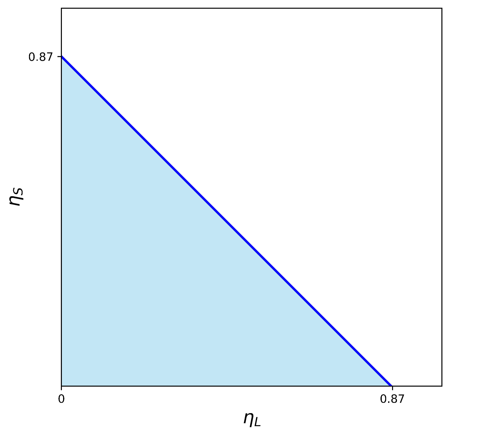

# Security Model

## Introduction

EigenDA는 EigenLayer 위에 구축된 고-throughput 탈중앙화 data availability (DA) layer로, 프로토콜이 사용 가능하다고 confirm한 데이터는 client가 안정적으로 retrieve할 수 있도록 보장하기 위해 설계되었다. 시스템은 두 가지 핵심 failure mode를 구분한다.

- **Safety failure**: DA layer가 유효한 availability certificate를 발급하지만, 사용자가 해당 데이터를 retrieve할 수 없는 경우.
- **Liveness failure**: 사용 가능해야 할 데이터(즉, 적절히 결제되었고 시스템 throughput 한계 안의 데이터)가 사용자에게 제공되지 않는 경우.

EigenDA는 restake된 collateral이 뒷받침하는 BFT security model을 통해 이러한 위험을 완화한다. DA layer에 참여하는 operator는 EigenLayer를 통해 stake(ETH, EIGEN, customized token)을 위임받는다.

추가로 EIGEN slashing이 강력한 책임성을 도입한다 — safety failure가 발생하면 stake가 slash될 수 있으며, 실제로 제공하지 않는 데이터에 대해 availability attestation에 서명한 operator를 처벌한다. 토큰 toxicity가 추가적인 경제적 alignment를 제공한다.

이 페이지에서는 EigenDA의 security guarantee를 기술적으로 분석한다.
이 문서에서 *validator*와 *operator*는 같은 의미로 혼용한다.

## Cryptographic Primitives

encoding module은 data blob을 encoded chunk 집합으로 확장하는 데 사용되며, 이 chunk로 blob을 재구성할 수 있다. encoding의 정확성은 proving module에 의해 증명된다. encoding과 proving module은 다음 두 핵심 속성을 만족해야 한다.

- 충분한 크기의 unique encoded chunk 집합으로 원본의 인코딩되지 않은 blob을 재구성할 수 있어야 한다.
- 각 chunk는 opening proof와 짝지어질 수 있어야 하며, 이를 통해 그 chunk가 특정 commitment에 해당하는 blob에서 적절히 도출되었음을 검증할 수 있어야 한다.

이러한 속성을 달성하기 위해 module은 다음 primitive를 제공한다.

- `EncodeAndProve`: data blob을 encoded chunk 집합으로 확장. opening proof와 blob commitment도 함께 생성.
- `Verify`: opening proof를 사용해 chunk를 blob commitment에 대해 검증.
- `Decode`: 충분한 크기의 encoded chunk 모음으로부터 원본 blob을 재구성.

EigenDA는 Reed Solomon encoding과 KZG polynomial commitment, opening proof를 함께 사용해 encoding module을 구현한다. encoding과 proving module에 대한 자세한 내용은 [code spec](https://github.com/Layr-Labs/eigenda/blob/master/docs/spec/src/protocol/architecture/encoding.md)에서 확인할 수 있다.

## Quorums and Security Models

EigenDA에는 서로 다른 자산(restaked-ETH, EIGEN, rollup의 customized token)이 operator에게 위임되는 세 종류의 quorum이 있다. 각 quorum은 서로 다른 security guarantee를 제공한다. safety attack이 성공적으로 실행되려면 세 종류의 quorum이 모두 동시에 실패해야 하므로, 다층적 보안 보장을 제공한다.

EigenDA의 세 가지 security model과 대응하는 quorum은 다음과 같다.

- BFT security: ETH, EIGEN, Custom Quorum
- Cryptoeconomic security: EIGEN Quorum
- Token Toxicity: Custom Quorum

먼저 각 security model의 개요와 EigenDA의 전체 회복력에 어떻게 기여하는지 살펴본다. **BFT security**는 악의적 validator가 보유한 stake 또는 voting power의 비율이 특정 threshold 미만으로 유지되는 한, 시스템의 safety와 liveness 양쪽을 모두 보장한다. **Cryptoeconomic security**는 한 걸음 더 나아간다 — 공격자가 잘못 행동하면, 상당량의 stake를 통제해야 할 뿐 아니라 slashing을 통해 그 stake를 잃을 위험까지 감수해야 한다. 이는 공격을 재정적으로 매력 없게 만든다. **Token toxicity**는 또 다른 incentive alignment layer를 추가한다 — validator가 잘못 행동하면 native token의 가치가 떨어질 수 있고, 그 validator에게 stake를 위임한 token holder가 손실을 입게 된다. 이런 동학은 stakeholder가 신뢰할 수 있는 operator를 신중히 고르도록 유도한다.

이 페이지의 나머지 부분에서는 세 가지 security가 어떻게 충족되는지 자세히 분석한다.

custom quorum과 security threshold 구현에 대한 정보는 [Custom Security](../../integrations-guides/custom-security.md)를 참고하라.

## BFT Security Model

BFT security model은 악의적 validator에게 위임된 stake가 사전 정의된 threshold 미만으로 유지되는 한 시스템의 safety와 liveness를 보장한다.
먼저 chunk assignment algorithm의 reconstruction guarantee를 분석하고, 이어서 EigenDA의 BFT security를 증명한다.

### Chunk Assignment Algorithm

이 절에서는 encoded chunk가 stake에 따라 각 validator에게 어떻게 할당되는지를 설명하고, 할당의 reconstruction 속성을 증명한다.

**Parameters**

EigenDA validator 사이의 데이터 할당은 chunk assignment 로직에 의해 지배된다. 이 로직은 `EigenDAServiceManager` 컨트랙트의 매핑을 통해 blob `Version`과 연결된 `BlobParameters` 집합을 입력으로 받는다. `BlobParameters`는 다음으로 구성된다.

- `NumChunks` — 각 blob에 대해 생성될 encoded chunk의 수(2의 거듭제곱이어야 함).
- `CodingRate` — encoded chunk의 총 크기를 원본 blob 크기로 나눈 값(2의 거듭제곱이어야 함). 표현을 위해 이 값은 coding theory에서 사용하는 standard coding rate의 역수임에 유의하라.
- `MaxNumOperators` — blob `Version`이 지원할 수 있는 최대 operator 수.

chunk assignment 로직은 다음 primitive를 제공한다.

- `GetChunkAssignments`: blob version과 validator 상태가 주어졌을 때, 각 chunk index에서 validator로의 매핑을 생성.
- `VerifySecurityParameters`: 주어진 security parameter 집합이 blob version에 대해 유효한지 검증.

모델링을 위해, 할당 로직이 operator $i$에게 매핑하는 chunk의 수를 $m_i$로 표기한다. blob version이 정의한 `NumChunks`를 $m$, `CodingRate`을 $r$, `MaxNumOperators`을 $n$으로 표기한다. $m/r$개의 unique chunk 집합으로 blob을 복원할 수 있다. $\alpha_i = rm_i/m$로 정의하며, 이는 validator $i$에게 할당된 chunk 수를 blob 복원에 필요한 chunk 수로 나눈 값이다. $\eta_i$는 validator $i$에게 할당된 quorum stake의 비율을 나타낸다. validator 그룹이 blob을 복원할 만큼의 chunk를 보유하기 위해 집합적으로 가져야 하는 총 stake의 최소 비율을 $\gamma$로 표기한다. 핵심 용어는 아래 표에 정리되어 있다.

| **Term** | **Symbol** | **Description** |
| --- | --- | --- |
| Max Validator Count |  $n$ | 시스템에 참여하는 validator node의 최대 수(현재 $n =200$) |
| Validator Set | $N$ | 모든 validator의 집합. $\|N\|$은 시스템에 참여하는 총 validator node 수. |
| Total Chunks | $m$ | encoding 후 총 chunk 수(현재 $m=8192$) |
| Coding Rate | $r$ | encoding 후 총 chunk 수 / encoding 전 총 chunk 수(현재 $r=8$) |
| Validator당 blob 비율 | $\alpha_i$ | $\alpha_i = rm_i/m$, quorum 안의 validator $i$에게 할당된, blob 복원에 필요한 chunk 비율 |
| Num of Chunks Assigned | $m_i$ | quorum 안의 validator $i$에게 할당된 chunk 수 |
| Validator Stake | $\eta_i$  | quorum 안에서 validator $i$의 stake 비율($0 \le \eta_i \le 1$, $\sum_{i} \eta_i = 1$) |
| Reconstruction Threshold | $\gamma$  | validator 그룹이 blob을 성공적으로 복원하기 위해 필요한 총 stake의 최소 비율 |

**Properties for a Single Quorum**

먼저 chunk assignment 로직과 단일 quorum 안에서 만족시키고자 하는 속성을 설명한다.
각 quorum에 대해 할당 알고리즘은 다음 속성을 만족하도록 설계된다.

1. Non-overlapping assignment: $\sum_i m_i \le m$.
2. Reconstruction: blob이 `VerifySecurityParameters`를 통과하면, $\sum_{i \in H} \eta_i \ge \gamma$를 만족하는 임의의 validator 집합 $H \subseteq N$에 대해 $\sum_{i\in H} \alpha_i \ge 1$이 성립해야 한다.

EigenDA는 여러 quorum을 지원하며, 단일 validator가 그중 여러 개에 참여할 수도 있다. 효율을 높이기 위해, 각 quorum 안에서 요구되는 availability와 safety 속성은 보존하면서 각 validator에게 할당되는 chunk 수를 최소화하는 최적화를 도입했다.

**Specification**

``GetChunkAssignments``

validator $i$에게 할당된 chunk 수는 다음과 같이 계산된다.
$$
m_i= \left\lceil\eta_i(m- n)\right\rceil,
$$
여기서 $n$은 최대 operator 수다.
validator를 결정적 순서로 ranking한 다음, 각 validator $i$가 $m_i$개의 chunk를 받을 때까지 chunk를 순차적으로 할당한다.

``VerifySecurityParameters``

다음 조건이 성립하는 한 검증이 성공한다.

$$
n \le m(1 - \frac{1}{r\gamma})
$$

위 부등식으로부터 $\gamma \ge \frac{m}{(m-n)r} > 1/r$를 도출할 수 있으며, 이는 chunk assignment 로직 때문에 reconstruction threshold가 복원에 필요한 stake의 이론적 하한($1/r$)보다 크다는 것을 의미한다.

**Proof of Properties**

`GetChunkAssignments`로 분배되었고 `VerifySecurityParameters`를 만족하는 blob에 대해 다음 속성이 성립함을 보이고자 한다.

1. Non-overlapping assignment 증명. 다음을 보자.
   $$\sum_{i} m'_{i} \le   \sum_{i} [\eta_{i} (m - n)+1] = m- n + \|N\| \le m$$
   따라서 모든 validator에게 할당된 chunk의 합이 그들에게 할당된 chunk보다 크다는 보장이 있어, 각 validator에게 할당된 chunk 사이에 중첩이 없음을 보장한다.

2. Reconstruction 증명. $\alpha_i  \ge \eta_i /\gamma$를 보인다.

$$
m_i \ge \eta_i(m - n) \ge \eta_i(m - m(1-1/r\gamma))=\eta_i m/(r\gamma)
$$

$$
\Rightarrow \alpha_i = rm_i/m \ge \eta_i/\gamma
$$

따라서 $\sum_{i \in H} \eta_i \ge \gamma$일 때 $\sum_{i\in H} \alpha_i \ge \sum_{i\in H} \eta_i/\gamma \ge 1$이다.
이는 총 stake의 $\gamma$ 이상을 가진 임의의 validator 집합이, 한 blob을 복원하는 데 필요한 만큼의 chunk(즉, 최소 $m/r$ chunk)를 집합적으로 보유함을 의미한다.
quorum 안에서 각 validator에게 할당된 chunk 사이에 중첩이 없으므로, 그들의 할당된 chunk를 합집합한 것이 전체 blob을 복원하는 데 사용될 수 있는 집합을 형성한다.

**Optimization: 각 validator에 할당되는 chunk 최소화**

EigenDA에서 client는 데이터를 저장하고 한 blob에 대한 DA certificate에 서명할 validator를 여러 quorum으로부터 요구할 수 있다.
한 validator가 동시에 여러 quorum에 참여할 수 있다.
chunk를 할당하는 순진한 방식은 위에서 설명한 chunk assignment 알고리즘을 각 quorum에 대해 독립적으로 실행하고, 각 validator가 quorum별로 저장해야 하는 chunk를 따로따로 보내는 것이다.
그러나 이 방식은 validator가 자신이 참여하는 모든 quorum의 워크로드 합을 저장하게 만들어 비효율적이고 성능을 떨어뜨린다.

각 validator에게 할당되는 chunk 수를 줄이기 위해 다음 전략을 적용한다.

1. 각 validator에게 여러 quorum에 걸쳐 할당된 chunk의 중첩(overlap)을 늘리는 최적화 알고리즘을 설계한다.
   또한 각 validator에게는 모든 quorum에 걸친 할당된 chunk의 합집합만 보내며, redundancy를 줄이고 전체 storage overhead를 최소화한다.

2. 어떤 validator에게 할당되는 unique chunk 수도 $m / r$로 cap된다.

최적화의 영향을 다음과 같이 분석한다.

1. 최적화 알고리즘은 어떤 quorum 안에서도 각 validator에게 할당되는 chunk 수를 바꾸지 않는다.
   non-overlapping 속성도 보존된다.
   따라서 각 quorum의 reconstruction guarantee는 변하지 않는다.

2. capping을 적용한 후에도 reconstruction 속성이 여전히 성립함을 보인다.

- Case 1: 적어도 $\gamma$ stake를 가진 validator 집합 중 누구에게도 $m / r$ 이상의 unique chunk가 할당되지 않은 경우, cap은 영향을 미치지 않는다. reconstruction 속성은 그대로 유지된다.

- Case 2: 선택된 집합의 validator에게 $m / r$ 이상의 chunk가 할당된 경우, cap이 그 할당량을 정확히 $m / r$ chunk로 줄인다. 이 validator 혼자 $m / r$개의 unique chunk를 보유하므로 blob을 복원할 수 있다. 따라서 validator 집합 전체도 blob을 복원할 능력을 유지한다.

### Safety and Liveness Analysis

이 절에서는 위에서 정립한 reconstruction 속성을 바탕으로 EigenDA의 safety와 liveness 속성을 정의하고 증명한다.

blob의 Byzantine liveness 및 safety 속성은 `SecurityThresholds` 모음으로 지정된다.

- `ConfirmationThreshold` ($\eta_C$로도 표기) — DA certificate를 유효하게 만들기 위해 서명해야 하는 stake의 최소 비율.
- `SafetyThreshold` ($\eta_S$로도 표기) — 유효한 DA certificate를 가진 blob을 사용 불가능하게 만들기 위해 공격자가 통제해야 하는 총 stake의 최소 비율.
- `LivenessThreshold` ($\eta_L$로도 표기) — liveness failure를 일으키기 위해 공격자가 통제해야 하는 총 stake의 최소 비율.

safety와 liveness를 보장하기 위한 가정부터 시작한다.

1. **Safety**를 보장하려면, 적이 총 stake의 `SafetyThreshold` 비율 미만을 통제한다고 가정한다.
2. **Liveness**를 보장하려면, 현재로서는 client의 blob disperser 요청을 검열하지 않는 신뢰된 disperser에 의존한다. 이 신뢰 가정을 제거하기 위해 곧 decentralized dispersal을 도입할 예정이다. 추가로 liveness를 보장하려면, 적이 총 stake의 `LivenessThreshold` 비율 미만을 위임받았다고 가정한다.

다음 부분에서는 이 가정이 만족될 때 security와 liveness가 성립함을 증명한다.

먼저 프로토콜의 security를 증명한다 — 악의적 측이 quorum 안에서 $\eta_S = \eta_C - \gamma$ 비율 미만의 stake만 위임받았다면, DA certificate가 발급되었을 때 어떤 최종 사용자도 blob이 사용 가능해야 하는 시간 범위 안에 그 blob을 retrieve할 수 있다.
증명:
DA certificate가 발급되려면 stake의 최소 $\eta_C = \eta_S + \gamma$ 비율이 blob에 서명해야 했고, 적의 stake 비율이 최대 $\eta_S$이므로, 적어도 $\eta_C - \eta_S = \gamma$ 비율의 stake를 위임받고 blob에 서명한 정직한 validator 집합 $H$가 존재한다.
앞 절에서 증명했듯, $\sum_{i \in H} \eta_i \ge \gamma$를 만족하는 임의의 validator 집합 $H$에 대해 $\sum_{i\in H} \alpha_i \ge 1$이 성립해야 한다 — 즉, $H$는 blob을 복원하기에 충분히 큰 chunk 집합을 보유하며, blob을 복원해 최종 사용자에게 제공할 수 있다.

다음으로 프로토콜의 liveness를 증명한다 — 악의적 측이 quorum 안에서 $\eta_L = 1 - \eta_C$ 비율 미만의 stake를 통제한다면, client가 dispersal 함수를 호출했을 때, disperser가 정직하다는 가정 하에 결국 자신이 제출한 blob에 대한 DA certificate를 받게 된다. 정직한 disperser는 프로토콜에 따라 chunk를 인코딩하고 분배하며, 모든 정직한 validator는 자신에게 할당된 chunk를 받아 검증하면 dispersal에 서명을 보낸다는 사실에서 단순히 따라온다. 따라서 정직한 stake 비율이 $\eta_C$보다 크므로 disperser는 충분한 서명을 수집할 수 있고, 결국 DA certificate가 발급된다.

### Encoding Rate and Security Thresholds

앞 절에서 적의 stake가 특정 threshold 미만으로 유지된다면 — 즉 safety와 liveness 속성이 모두 유지된다면 — 시스템이 안전함을 보였다. 이 절에서는 시스템 overhead를 정량화하기 위해, 주어진 적의 stake 비율에 기반해 필요한 최소 encoding rate를 결정하고자 한다.

safety를 침해하는 데 사용될 수 있는 최대 적 stake를 $\eta_s$로, liveness를 침해하는 데 사용될 수 있는 최대 stake를 $\eta_l$로 표기한다. 시스템의 보안을 보장하려면 다음 조건이 만족되어야 한다 — $\eta_s \le \eta_S = \eta_C - \gamma$ 그리고 $\eta_l \leq \eta_L = 1 - \eta_C$. 이 부등식들로부터 $\gamma \le 1 - \eta_s - \eta_l$를 도출할 수 있다. 또한 $\gamma \ge \frac{m}{(m-n)r}$임을 떠올리자. 이로부터 encoding rate $r$에 대한 다음 제약을 얻는다.

$$
\frac{m}{(m-n)r}  \leq 1 - \eta_s - \eta_l \Leftrightarrow r \ge \frac{m}{(m-n)(1-\eta_s-\eta_l)}
$$

시스템이 safety attack에 대해 최대 54%의 적 stake($\eta_s = 54 \%$), liveness attack에 대해 최대 33%의 적 stake($\eta_l = 33 \%$)까지 견디는 것을 목표로 하고, 시스템 파라미터 $m = 8192$, $n = 200$이 주어졌을 때, $r \ge 8192 / (8192-200)/(1-54\% -33\%)= 7.9$로 계산된다. 따라서 이러한 적대적 조건 하에서 시스템 보안을 보장하려면 encoding rate가 최소 7.9 이상이어야 한다.

우리의 구현에서는 encoding rate $r = 8$을 선택한다(즉, 시스템이 8X overhead로 동작). 따라서 $\gamma$의 최솟값은 $\gamma_{min} = \frac{8192}{(8192-200)*8} = 0.13$로 계산된다. 이로부터 다음 safety 및 liveness threshold가 도출된다 — $\eta_S = \eta_C - 0.13$ 와 $\eta_L = 1 - \eta_C$. 두 식을 결합하면 $\eta_S + \eta_L = 0.87$. 선택된 파라미터에서의 safety-liveness threshold trade-off는 아래 그림에 그려져 있다. stake profile $(\eta_s, \eta_l)$가 그래프의 line 아래에 있는 어떤 적도 시스템의 방어 가능 영역 안에 있다.

  

## Cryptoeconomic Security Model

BFT security에 더해, EIGEN quorum은 추가 보호 layer로 cryptoeconomic security를 제공한다. cryptoeconomic security는 시스템의 safety가 침해될 경우 일정 비율의 stake가 slash되도록 보장한다. 이는 시스템 공격에 강한 disincentive를 만든다. 공격의 총 비용이 항상 공격으로부터의 총 이익을 초과할 때 프로토콜이 cryptoeconomically secure하다고 본다. 그러나 다른 많은 공격과 마찬가지로 DA withholding attack에서 가능한 이익은 정량화하기 어렵다. 그래서 강조점은 slashing에 놓인다 — 잘못 행동하는 validator를 처벌할 수 있는 능력이 시스템 safety 유지의 핵심이다.

### Token Forking을 통한 Intersubjective Slashing

BFT security가 실패하고 유효한 DA certificate에 의해 인증된 데이터가 retrieve 불가능해지면, 어떤 커뮤니티 구성원이든 data unavailability alarm을 발동할 수 있다. 한 번 트리거되면 다른 커뮤니티 구성원이 데이터를 retrieve하고 검증하려 시도한다. 충분한 수의 커뮤니티 구성원이 safety가 실제로 침해됐음을 confirm하면, dishonest validator의 stake를 slash하기 위해 token fork를 시작할 수 있다([EIGEN Token Whitepaper](https://docs.eigenlayer.xyz/assets/files/EIGEN_Token_Whitepaper-0df8e17b7efa052fd2a22e1ade9c6f69.pdf) 참고).

### DAS: Slashing을 위한 Fraud Detection 도구

[Security FAQs](security-FAQs.md)에서 논의했듯, Data Availability Sampling (DAS) 프로토콜은 fraud detection에 유용하며, 특히 자원이 제한된 light node에 그러하다 — 한계가 있긴 하지만. 우리는 이 한계를 해결하기 위해 EigenDA용 DAS 프로토콜을 적극 개발 중이며, fraud detection과 intersubjective slashing에 더 나은 지원을 제공한다. 자세한 white paper가 곧 공개될 예정이다.

## Token Toxicity Security Model

BFT security에 더해, [custom quorum](../../integrations-guides/custom-security.md)은 Token Toxicity를 통해 추가 security guarantee를 제공한다. token toxicity는 rollup이 제대로 동작하지 않을 때 그 rollup의 native token 가치가 급락하는 현상을 가리킨다. 구체적으로, rollup에 대해 DA가 보장되지 않으면 rollup 서비스에 대한 시장 신뢰가 떨어져 토큰 가격이 하락한다. 이 경제적 incentive는 rollup의 custom token holder가 자신의 stake를 신뢰할 수 있는 operator에게만 위임하도록 유도해, data unavailability와 토큰 가치 손실 위험을 최소화한다.

결론적으로, EigenDA의 security model은 BFT security, cryptoeconomic security, token toxicity를 결합해 safety 및 liveness 실패에 대한 견고하고 다층적인 방어를 만든다.
